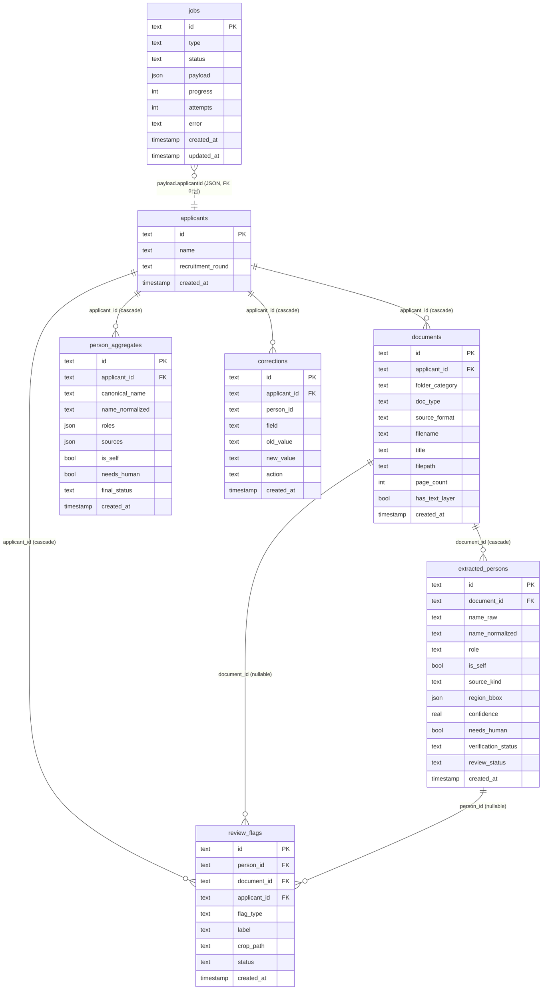
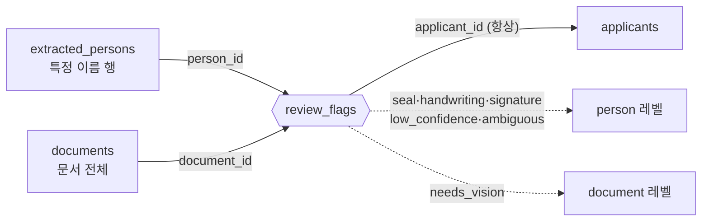

# 데이터 모델

이 문서는 Minesweeper(채용 이해충돌 관계자 추출 시스템)의 영속 데이터 모델을 설명한다.
스키마 정의는 단일 출처(single source of truth)인 [`src/db/schema.ts`](../src/db/schema.ts)에 있고,
도메인 enum/타입은 [`src/lib/domain.ts`](../src/lib/domain.ts)에, 마이그레이션 SQL은
[`drizzle/0000_certain_switch.sql`](../drizzle/0000_certain_switch.sql)에 생성되어 있다. 본 문서의 모든
컬럼명·타입·기본값은 이 파일들에서 그대로 인용한 것이며 추측은 없다.

관련 문서: 백그라운드 처리 흐름은 [`./worker.md`](./worker.md), 4단 추출 파이프라인은
[`./pipeline.md`](./pipeline.md)를 참고하라.

설계 원칙은 단순하다. **자동 추출은 초안, 최종 판단은 사람.** 따라서 데이터 모델은 (a) 원본 추출 결과를
손실 없이 보존하고, (b) 지원자 단위로 사람을 통합하며, (c) 사람의 모든 수정 행위를 감사 로그로 남기도록
3계층으로 나뉜다.

---

## 1. 관계 개요

핵심 골격은 다음 한 줄로 요약된다.

```
1 applicant : N documents : (per-document) N extracted_persons
                                              │  (지원자 단위 dedup)
                                              ▼
                                         M person_aggregates
```

- **`applicants`** — 지원자 1명. `name`은 지원자 본인을 탐지·제외(`is_self`)하는 기준이 된다.
- **`documents`** — 지원자에게 첨부된 문서 1건. 폴더(`folder_category`)와 태그/내용으로 `doc_type`이 결정된다.
- **`extracted_persons`** — 문서별 원시 추출 결과. `(person, document, role)` 발생당 1행. 같은 사람이 여러
  문서·여러 역할로 나타나면 여러 행이 된다.
- **`person_aggregates`** — 지원자 단위 중복 제거 결과. 실제 사람 1명당 1행이며, 여러 문서에 걸친 역할
  (`roles`)과 출처(`sources`)가 합쳐진다.
- **`jobs`** — 워커가 폴링하는 배치 큐. `payload`에 `applicantId`가 담긴다.
- **`review_flags`** — "검토 필요 큐". person 레벨(도장/손글씨/서명 등) 또는 document 레벨(`needs_vision`)
  플래그를 모아 사람이 빠르게 검토하게 한다.
- **`corrections`** — 사람의 수정 행위 감사 로그. 향후 학습 데이터 + 정확도 추적용.

### ER 다이어그램



> **FK 주의.** `jobs.payload.applicantId`는 JSON 컬럼 안의 값이며 외래키 제약이 아니다(그림에서 점선).
> `corrections.person_id` 또한 일반 `text` 컬럼으로 FK 제약이 없다(이유는 §4 참조).
> 진짜 FK는 `documents`, `extracted_persons`, `person_aggregates`, `review_flags`, `corrections`의
> `applicant_id`(→`applicants`), `documents.applicant_id`, `extracted_persons.document_id`,
> `review_flags.person_id`/`document_id`이며 전부 `ON DELETE cascade`다.

삭제 전파: `applicants` 한 행을 지우면 cascade로 그 지원자의 `documents` → `extracted_persons` →
`review_flags`가 전부 따라 지워지고, `person_aggregates`/`corrections`도 함께 정리된다.

---

## 2. 테이블별 컬럼 정의 (7개)

모든 테이블의 `id`는 `text PRIMARY KEY`이며 기본값은 `crypto.randomUUID()`(`uuid()` 헬퍼)다.
`created_at`은 `integer('created_at', { mode: 'timestamp' })`로 저장되며 기본값은 `new Date()`다
(libsql/SQLite에서는 Unix epoch 정수로 저장되고 Drizzle이 `Date`로 매핑한다).

### 2.1 `applicants`

지원자 1명. `name`으로 지원자 본인을 탐지/제외한다.

| 컬럼 | 타입 | 의미 |
|---|---|---|
| `id` | `text` PK, `$defaultFn(uuid)` | 지원자 식별자 |
| `name` | `text` NOT NULL | 지원자 성명. 본인 제외(`is_self`) 판정 기준 |
| `recruitmentRound` | `text` (nullable) | 채용 회차/공고 식별(`recruitment_round`) |
| `createdAt` | `timestamp` NOT NULL | 생성 시각 |

### 2.2 `documents`

첨부 문서 1건. 주석 그대로: *folder=category, [tag]/content => doc_type.*

| 컬럼 | 타입 | 의미 |
|---|---|---|
| `id` | `text` PK | 문서 식별자 |
| `applicantId` | `text` NOT NULL, FK→`applicants.id` (cascade) | 소속 지원자 |
| `folderCategory` | `text` (nullable) | 폴더로 결정된 분류(`folder_category`) |
| `docType` | `text` `$type<DocType>()` NOT NULL, default `'unknown'` | 문서 유형 (§DOC_TYPES) |
| `sourceFormat` | `text` `$type<SourceFormat>()` NOT NULL | 원본 형식 (§SOURCE_FORMATS) |
| `filename` | `text` NOT NULL | 원본 파일명 |
| `title` | `text` (nullable) | 추출/추정된 제목 |
| `filepath` | `text` NOT NULL | 저장된 파일 경로 |
| `pageCount` | `integer` NOT NULL, default `0` | 페이지 수 |
| `hasTextLayer` | `integer{boolean}` NOT NULL, default `false` | 텍스트 레이어 보유 여부(PDF) |
| `createdAt` | `timestamp` NOT NULL | 생성 시각 |

`source_format`(형식)과 `doc_type`(유형)은 의도적으로 분리된 두 축이다. 형식 차이는 파이프라인 1단(Ingest)에서만,
유형 차이는 3단(Extract)에서만 다뤄진다 — [`./pipeline.md`](./pipeline.md) 참조.

### 2.3 `extracted_persons`

문서별 원시 추출. *One row per (person, document, role) occurrence.*

| 컬럼 | 타입 | 의미 |
|---|---|---|
| `id` | `text` PK | 추출 행 식별자 |
| `documentId` | `text` NOT NULL, FK→`documents.id` (cascade) | 출처 문서 |
| `nameRaw` | `text` NOT NULL | OCR/추출된 원문 이름 (`name_raw`) |
| `nameNormalized` | `text` NOT NULL | 정규화된 이름 (dedup 매칭 키, `name_normalized`) |
| `nameEn` | `text` (nullable) | 영문 이름 |
| `nameKo` | `text` (nullable) | 한글 이름 |
| `nameInitials` | `text` (nullable) | 이니셜 (동명이인/약어 처리) |
| `role` | `text` `$type<Role>()` NOT NULL | 관계 역할 (§ROLES) |
| `affiliation` | `text` (nullable) | 소속 |
| `isSelf` | `integer{boolean}` NOT NULL, default `false` | 지원자 본인 여부 |
| `sourceKind` | `text` `$type<SourceKind>()` NOT NULL, default `'printed'` | 출처 종류 (§SOURCE_KINDS) |
| `sourcePage` | `integer` NOT NULL, default `1` | 페이지 번호 (`source_page`) |
| `regionBbox` | `text{json}` `$type<Bbox \| null>()` | 페이지 내 영역 좌표 (§3) |
| `cropPath` | `text` (nullable) | 잘라낸 이미지 경로 (도장/서명 등) |
| `ocrEngine` | `text` (nullable) | 사용된 OCR 엔진 |
| `ocrConfidence` | `real` (nullable) | OCR 신뢰도 |
| `confidence` | `real` NOT NULL, default `0` | 추출 신뢰도 |
| `needsHuman` | `integer{boolean}` NOT NULL, default `true` | 사람 검토 필요 여부 |
| `verificationStatus` | `text` `$type<VerificationStatus>()` (nullable) | 인쇄 이름의 도장/서명 교차검증 결과 |
| `reviewStatus` | `text` `$type<ReviewStatus>()` NOT NULL, default `'pending'` | 행 단위 검토 상태 |
| `createdAt` | `timestamp` NOT NULL | 생성 시각 |

### 2.4 `person_aggregates`

지원자 단위 dedup. *one row per real person, roles unioned across documents.*

| 컬럼 | 타입 | 의미 |
|---|---|---|
| `id` | `text` PK | 통합 식별자 |
| `applicantId` | `text` NOT NULL, FK→`applicants.id` (cascade) | 소속 지원자 |
| `canonicalName` | `text` NOT NULL | 대표 이름 (`canonical_name`) |
| `nameNormalized` | `text` NOT NULL | 정규화 이름 (extracted_persons와 매칭) |
| `roles` | `text{json}` `$type<Role[]>()` NOT NULL, default `[]` | 문서들에서 합쳐진 역할 집합 (§3) |
| `sources` | `text{json}` `$type<SourceRef[]>()` NOT NULL, default `[]` | 발견 출처 목록 (provenance, §3) |
| `affiliation` | `text` (nullable) | 소속 |
| `isSelf` | `integer{boolean}` NOT NULL, default `false` | 지원자 본인 여부 |
| `needsHuman` | `integer{boolean}` NOT NULL, default `true` | 사람 검토 필요 여부 |
| `finalStatus` | `text` `$type<ReviewStatus>()` NOT NULL, default `'pending'` | 통합행의 **최종** 검토 상태 |
| `createdAt` | `timestamp` NOT NULL | 생성 시각 |

`reviewStatus`(extracted_persons, 행 단위)와 `finalStatus`(person_aggregates, 사람 단위)는 별개다.
둘 다 `ReviewStatus` enum(`pending|confirmed|rejected|edited`)을 쓰지만, 전자는 개별 추출 발생,
후자는 통합된 사람에 대한 사람의 최종 판단을 나타낸다.

### 2.5 `jobs`

백그라운드 배치 큐. 워커가 이 테이블을 폴링한다 — [`./worker.md`](./worker.md).

| 컬럼 | 타입 | 의미 |
|---|---|---|
| `id` | `text` PK | 작업 식별자 |
| `type` | `text` NOT NULL, default `'process_applicant'` | 작업 종류 |
| `status` | `text` `$type<JobStatus>()` NOT NULL, default `'queued'` | 작업 상태 (§JOB_STATUSES) |
| `payload` | `text{json}` `$type<JobPayload>()` NOT NULL | 작업 입력 (`{ applicantId }`, §3) |
| `progress` | `integer` NOT NULL, default `0` | 진행률(0~100) |
| `attempts` | `integer` NOT NULL, default `0` | 시도 횟수(재시도 추적) |
| `error` | `text` (nullable) | 마지막 오류 메시지 |
| `createdAt` | `timestamp` NOT NULL | 생성 시각 |
| `updatedAt` | `timestamp` NOT NULL, `$defaultFn(() => new Date())` | 갱신 시각(상태/진행 변경 시) |

`JobStatus = 'queued' | 'running' | 'done' | 'error'`. `JobPayload`는 `schema.ts`에 인터페이스로 정의된다:

```ts
export interface JobPayload {
  applicantId: string;
}
```

### 2.6 `review_flags`

"검토 필요 큐" — 도장/손글씨/모호 항목을 모아 빠른 사람 검토를 돕는다. person/document 이중 용도(§5).

| 컬럼 | 타입 | 의미 |
|---|---|---|
| `id` | `text` PK | 플래그 식별자 |
| `personId` | `text` FK→`extracted_persons.id` (cascade), **nullable** | person 레벨 플래그 대상 |
| `documentId` | `text` FK→`documents.id` (cascade), **nullable** | document 레벨 플래그 대상 |
| `applicantId` | `text` NOT NULL, FK→`applicants.id` (cascade) | 소속 지원자(항상 존재) |
| `flagType` | `text` `$type<FlagType>()` NOT NULL | 플래그 종류 (§FLAG_TYPES) |
| `label` | `text` (nullable) | 표시 라벨 |
| `cropPath` | `text` (nullable) | 잘라낸 이미지 경로 |
| `status` | `text` `$type<'open' \| 'resolved'>()` NOT NULL, default `'open'` | 플래그 처리 상태 |
| `createdAt` | `timestamp` NOT NULL | 생성 시각 |

`status`는 enum 파일이 아니라 schema.ts에 인라인 union `'open' | 'resolved'`로 직접 정의되어 있다.

### 2.7 `corrections`

사람의 수정 감사 로그 — 미래 학습 데이터 + 정확도 추적.

| 컬럼 | 타입 | 의미 |
|---|---|---|
| `id` | `text` PK | 감사 로그 식별자 |
| `applicantId` | `text` NOT NULL, FK→`applicants.id` (cascade) | 소속 지원자 |
| `personId` | `text` (nullable, **FK 아님**) | 대상 사람(통합/추출 식별자, 자유 참조) |
| `field` | `text` NOT NULL | 수정된 필드명 |
| `oldValue` | `text` (nullable) | 수정 전 값 (`old_value`) |
| `newValue` | `text` (nullable) | 수정 후 값 (`new_value`) |
| `action` | `text` `$type<'confirm' \| 'edit' \| 'reject' \| 'exclude'>()` NOT NULL | 수정 행위 종류 |
| `createdAt` | `timestamp` NOT NULL | 발생 시각 |

`action` 역시 schema.ts 인라인 union `'confirm' | 'edit' | 'reject' | 'exclude'`이며, 사람 검토 UI의
네 가지 동작(확인/편집/거부/제외)에 대응한다.

> **enum vs union 정리.** `DocType`, `SourceFormat`, `Role`, `SourceKind`, `ReviewStatus`,
> `VerificationStatus`, `FlagType`, `JobStatus`는 `domain.ts`의 공유 enum이다. 반면
> `review_flags.status`와 `corrections.action`은 schema.ts 안에서만 쓰이는 인라인 string union이다.

---

## 3. JSON 컬럼

SQLite/libsql에는 네이티브 JSON 타입이 없으므로 Drizzle의 `text(name, { mode: 'json' })`로 직렬화한다.
`.$type<T>()`로 TypeScript 측 타입을 고정한다. 마이그레이션 SQL에서는 전부 `text` 컬럼으로 보인다.

### 3.1 `extracted_persons.region_bbox` → `Bbox | null`

페이지 이미지 위의 사각형 영역. 좌표 규약(정규화 0..1 vs 픽셀)은 호출자 컨벤션이다(주석 그대로).

```ts
export interface Bbox {
  x: number;
  y: number;
  w: number;
  h: number;
  page?: number;
}
```

도장/서명 crop, 비전 판독 영역 표시 등에 쓰인다. `crop_path`와 함께 검토 UI에서 해당 영역을 보여준다.

### 3.2 `person_aggregates.roles` → `Role[]`

여러 문서에서 같은 사람이 가졌던 역할들의 합집합. default는 빈 배열 `[]`. 예: 같은 교수가 한 논문에서
`coauthor`, 학위논문에서 `supervisor`였다면 `["supervisor", "coauthor"]`.

### 3.3 `person_aggregates.sources` → `SourceRef[]`

각 이름이 **어디서** 발견됐는지(provenance). 검토 UI에서 이름 옆에 출처로 표시된다.

```ts
export interface SourceRef {
  documentId: string;
  filename: string;
  docType: DocType;
  page: number;
  role: Role;
  sourceKind: SourceKind;
  confidence: number;
  /** 이름이 나온 줄/스니펫 (검토 UI hover) */
  evidence?: string;
}
```

`sources` 배열은 본질적으로 통합 전 `extracted_persons` 행들을 사람이 읽을 수 있는 형태로 비정규화한 것이다.
원본 행은 `extracted_persons`에 그대로 남아 있고, 통합 결과 요약이 여기에 들어간다.

### 3.4 `jobs.payload` → `JobPayload`

`{ applicantId: string }`. 워커는 이 값으로 어떤 지원자를 처리할지 결정한다. FK 제약은 없지만 의미상
`applicants.id`를 가리킨다.

---

## 4. 레코드 라이프사이클

한 지원자가 시스템을 통과하는 동안 행들이 만들어지는 순서:

```
[1] 업로드
    └─ applicants (1행) + documents (N행) 생성
       jobs 에 { applicantId } 1행 enqueue (status='queued')

[2] 워커 처리  (src/worker, ./worker.md / ./pipeline.md)
    queued → running (progress, updatedAt 갱신)
    └─ 4단 파이프라인 실행 (Ingest → Type → Extract → Aggregate)
       ├─ documents.docType / pageCount / hasTextLayer 등 채움
       ├─ extracted_persons (문서별 N행) 적재   ← 원시 추출
       ├─ review_flags (도장/손글씨/needs_vision 등) 적재
       └─ person_aggregates (지원자 단위 dedup) 통합  ← roles/sources union
    running → done (또는 error, error 컬럼에 메시지)

[3] 사람 검토
    └─ extracted_persons.reviewStatus  (행 단위: pending→confirmed/rejected/edited)
       person_aggregates.finalStatus   (사람 단위 최종 판단)
       review_flags.status             (open → resolved)

[4] 감사
    └─ 모든 검토 행위가 corrections 에 1행씩 기록
       (field, oldValue, newValue, action)
```

요점:

1. **업로드 단계**는 `applicants` + `documents`를 만들고 `jobs`에 작업을 넣을 뿐, 추출은 하지 않는다.
   `next build`가 서버 모듈을 평가할 때 DB 파일을 열지 않도록 클라이언트는 lazy singleton이다(§6).
2. **워커**가 `extracted_persons`를 적재하고(원시·손실 없음), 이어서 `person_aggregates`로 통합한다.
   `name_normalized`가 dedup 매칭 키다.
3. **사람 검토**는 두 레벨 상태를 다룬다 — 개별 추출(`reviewStatus`)과 통합 사람(`finalStatus`). 둘 다
   `ReviewStatus` enum을 쓴다.
4. **`corrections`**는 사람이 무엇을 바꿨는지(확인/편집/거부/제외)를 영구 보존한다. 따라서 `person_id`에
   FK를 걸지 않는다 — 대상 행이 나중에 cascade로 삭제되거나 재처리로 교체돼도 감사 기록은 남아야 하기
   때문이다. 이 로그가 향후 추출기 학습 데이터와 정확도 지표의 근거가 된다.

원칙 재확인: 자동 추출은 어디까지나 **초안**이고, `reviewStatus`/`finalStatus`/`corrections`를 통한
사람의 판단이 **최종**이다. 시스템은 절대 이름을 지어내지 않는다(추출 못하면 `needs_human=true`로 큐에 올린다).

---

## 5. `review_flags`의 person/document 이중 용도

`review_flags`는 하나의 테이블로 두 종류의 "검토 필요" 항목을 담는다. 차이는 어느 FK가 채워지는가다.

| 용도 | 채워지는 FK | 비는 FK | 대표 `flag_type` |
|---|---|---|---|
| **person 레벨** | `person_id` (→`extracted_persons`) | `document_id` = NULL | `seal`, `handwriting`, `signature`, `low_confidence`, `ambiguous` |
| **document 레벨** | `document_id` (→`documents`) | `person_id` = NULL | `needs_vision` |

`applicant_id`는 **두 경우 모두 항상** 채워진다(NOT NULL). 따라서 지원자 단위로 "검토 필요 큐"를 한 번에
조회할 수 있다.



핵심:

- `needs_vision`은 **문서 레벨** 플래그다. 텍스트 레이어가 없거나 인쇄/필기가 섞여 비전(VLM) 판독이 필요한
  문서 자체를 가리키므로, 특정 person 행이 아니라 `document_id`에 붙는다(`person_id`는 NULL).
- 도장/손글씨/서명/저신뢰/모호(`seal|handwriting|signature|low_confidence|ambiguous`)는 특정 추출 이름
  행에 붙는 **person 레벨** 플래그다(`person_id` 채움, `document_id`는 NULL).
- `FlagType` 전체 값: `seal | handwriting | signature | low_confidence | ambiguous | needs_vision`
  (한국어 라벨은 `FLAG_TYPE_LABELS_KO`: 도장 / 손글씨 / 서명 / 저신뢰 / 동명이인·약어 / 비전 판독 필요).
- `status`(`open | resolved`)로 처리 여부를 추적한다.

추출기는 pluggable이다 — 기본/테스트는 `stub`, 온프레미스 비전은 `vlm`(기본 Ollama qwen3.5:9B). `vlm`이
필요한 문서를 표시하는 신호가 바로 document 레벨 `needs_vision` 플래그다. 자세한 흐름은
[`./pipeline.md`](./pipeline.md) 참조.

---

## 6. 임베디드 DB 클라이언트와 마이그레이션 워크플로우

### 6.1 클라이언트 (`src/db/client.ts`)

embedded libsql(`@libsql/client`) 위에 Drizzle을 얹는다. 두 진입점이 있다.

```ts
export type DB = LibSQLDatabase<typeof schema>;

/** url 예: "file:./data/minesweeper.db" 또는 ":memory:" (tests). */
export function createDb(url: string): DB {
  const client = createClient({ url });
  return drizzle(client, { schema });
}

export function getDb(): DB { /* lazy singleton */ }
```

- **`createDb(url)`** — 명시적 URL로 새 연결을 만든다. 테스트는 `:memory:`를, 운영은
  `file:./data/minesweeper.db`를 쓴다.
- **`getDb()`** — lazy singleton. 기본 URL은 `process.env.DATABASE_URL ?? 'file:./data/minesweeper.db'`.
  모듈을 import하는 것만으로 파일을 열지 않는다 — `next build`가 서버 모듈을 평가할 때 디스크를 건드리면
  안 되기 때문이다. **첫 실제 사용 시점**에 연결이 생성된다.
- `schema`를 함께 export하므로 `db.query.*` 관계형 API를 검토 UI에서 편하게 쓸 수 있다(스키마의 `relations(...)`
  정의가 이를 뒷받침: `applicantsRelations`, `documentsRelations`, `extractedPersonsRelations`,
  `personAggregatesRelations`).

### 6.2 마이그레이션 (`src/db/migrate.ts`)

```ts
const MIGRATIONS_FOLDER = './drizzle';

export async function runMigrations(db: DB, migrationsFolder = MIGRATIONS_FOLDER): Promise<void> {
  await migrate(db, { migrationsFolder });
}

/** 테스트 편의: 새로 마이그레이트된 in-memory DB. */
export async function createMigratedDb(url = ':memory:'): Promise<DB> {
  const db = createDb(url);
  await runMigrations(db);
  return db;
}
```

- **`runMigrations(db, folder?)`** — `drizzle/` 폴더의 생성된 마이그레이션을 모두 적용한다.
  drizzle-orm/libsql/migrator의 `migrate`를 감싼 것이며, 테스트에서도 재사용된다.
- **`createMigratedDb(url=':memory:')`** — 테스트용. 새 `:memory:` DB를 만들고 즉시 마이그레이트한다.
  vitest 스위트가 격리된 깨끗한 DB를 얻는 표준 방법이다.
- `main()`은 `tsx src/db/migrate.ts`로 직접 실행될 때만 동작한다. `file:` URL이면 디렉터리를
  `mkdirSync(..., { recursive: true })`로 먼저 만든 뒤 마이그레이션을 적용하고
  `✓ migrations applied to <url>`을 출력한다.

### 6.3 워크플로우

```
스키마 수정 (src/db/schema.ts)
        │
        ▼
npm run db:generate     # drizzle-kit generate → drizzle/*.sql 생성
        │
        ▼
npm run db:migrate      # tsx src/db/migrate.ts → DB에 적용
        │
        ▼
테스트는 createMigratedDb(':memory:')로 매번 새 DB
```

- **`db:generate`** = `drizzle-kit generate` — `schema.ts` 변경분으로부터 새 마이그레이션 SQL을 만든다.
  설정은 [`drizzle.config.ts`](../drizzle.config.ts).
- **`db:migrate`** = `tsx src/db/migrate.ts` — 생성된 마이그레이션을 실제 DB(기본
  `file:./data/minesweeper.db`)에 적용한다.

현재 마이그레이션은 단일 파일 [`drizzle/0000_certain_switch.sql`](../drizzle/0000_certain_switch.sql)이며,
journal(`drizzle/meta/_journal.json`)에 `0000_certain_switch` 항목 하나가 sqlite dialect로 등록되어 있다.
이 SQL이 위 7개 테이블을 모두 생성하며, 모든 FK는 `ON UPDATE no action ON DELETE cascade`로 만들어진다.

---

## 부록 — 도메인 enum 빠른 참조 (`src/lib/domain.ts`)

| enum | 값 |
|---|---|
| `SOURCE_FORMATS` | `pdf` · `image` · `hwp` · `text` |
| `DOC_TYPES` | `degree_thesis` · `representative_research` · `journal_article` · `hindex` · `unknown` |
| `ROLES` | `supervisor` · `co_supervisor` · `committee` · `department_head` · `principal_investigator` · `research_staff` · `coauthor` · `division_head` · `office_head` · `project_manager` |
| `SOURCE_KINDS` | `printed` · `handwritten` · `seal` · `signature` |
| `REVIEW_STATUSES` | `pending` · `confirmed` · `rejected` · `edited` |
| `VERIFICATION_STATUSES` | `confirmed` · `mismatch` · `unverifiable` |
| `FLAG_TYPES` | `seal` · `handwriting` · `signature` · `low_confidence` · `ambiguous` · `needs_vision` |
| `JOB_STATUSES` | `queued` · `running` · `done` · `error` |

> `division_head` / `office_head` / `project_manager`는 내부 직원 관계 역할로, Phase 2 워크스트림이지만
> 완전성을 위해 지금 모델에 포함되어 있다(domain.ts 주석 그대로).
