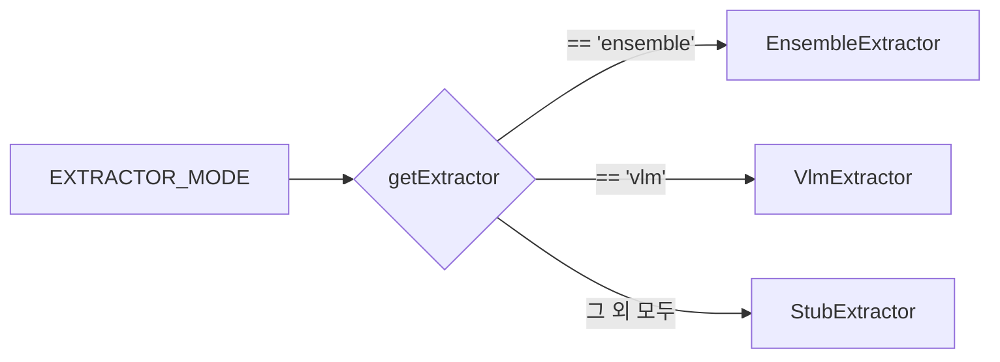
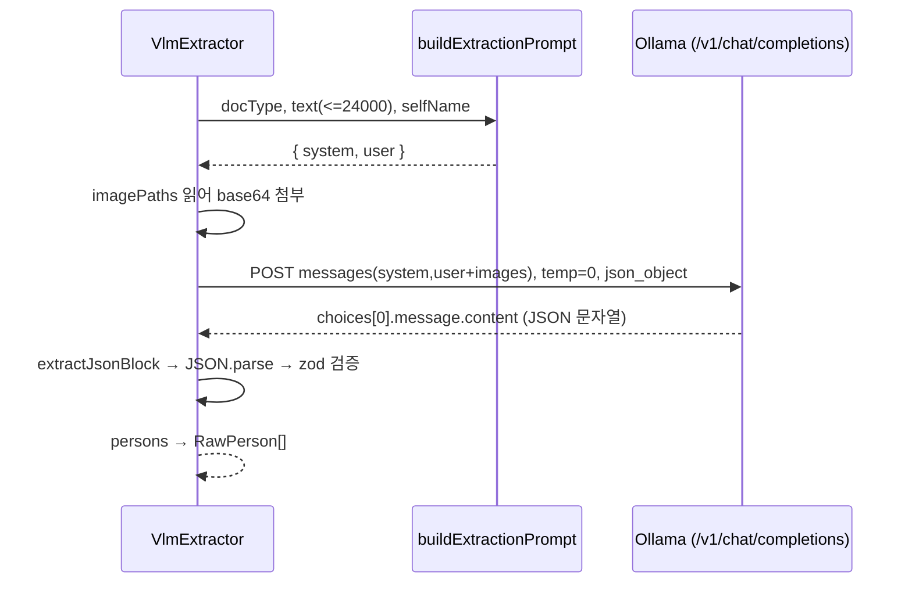

# Stage 3 추출기 (교체 가능)

> 파이프라인 전체 구조는 [pipeline.md](./pipeline.md) 를, 추출된 `nameRaw` 의 정규화·동일인 판정은
> [names-and-matching.md](./names-and-matching.md) 를, stub 과 vlm 의 정밀도/재현율 비교 측정은
> [model-evaluation.md](./model-evaluation.md) 를 참고하라.

Stage 3 (Extract) 는 4단 파이프라인 `Ingest → Type → Extract → Aggregate` 중 세 번째 단계다.
입력은 "문서 한 건 + 그 문서의 유형(`DocType`)"이고, 출력은 "그 문서에서 발견된 사람 한 명당 한 개의
`RawPerson`" 배열이다. **문서 형식의 차이(pdf/image/hwp/text)는 1단(Ingest)에서 이미 흡수**되었으므로
Stage 3 는 형식을 모른다. 오직 **문서 유형의 차이**(`degree_thesis` vs `journal_article` vs `hindex` …)
에만 분기한다. 이 설계 덕분에 추출기를 통째로 교체해도 다른 단계는 손대지 않는다.

이 단계의 가장 중요한 원칙은 README 와 동일하다: **자동 추출은 초안일 뿐, 최종 판단은 사람이 한다.
그리고 추출기는 절대 이름을 지어내지 않는다.** 문서에 실제로 나타난 이름만 뽑고, 없으면 빈 배열을 돌려준다.

추출기는 두 가지 구현이 함께 제공되며 환경변수 하나로 교체된다.

| 모드 | 클래스 | 성격 | 용도 |
|------|--------|------|------|
| `stub` (기본) | `StubExtractor` | 결정론적·GPU 불필요·휴리스틱 | 개발 기본값, **모든 테스트가 쓰는 유일한 추출기** |
| `vlm` | `VlmExtractor` | 온프레 비전/LLM (OpenAI 호환 엔드포인트) | 운영 경로, 스캔/이미지 문서까지 처리 |

---

## 1. Extractor 인터페이스와 `getExtractor` 팩토리

### 1.1 타입 계약

추출기가 지켜야 하는 인터페이스는 `src/lib/pipeline/types.ts` 에 정의되어 있다.

```ts
/** Pluggable Stage 3 extractor. Implementations: deterministic stub, on-prem VLM client. */
export interface Extractor {
  readonly name: string;
  extract(input: ExtractInput): Promise<RawPerson[]>;
}
```

입력 `ExtractInput` 은 한 문서 한 건을 표현한다.

```ts
/** Input to a Stage 3 extractor for a single document. */
export interface ExtractInput {
  docType: DocType;
  pages: PageBundle[];
  filename: string;
  /** Applicant name, used to tag is_self. */
  selfName?: string;
  /** Page images for vision-based extraction (scanned PDFs / hindex). */
  imagePaths?: string[];
}
```

여기서 `PageBundle` 은 1단(Ingest)이 만들어 둔, 형식과 무관한 정규화 페이지다.

```ts
/** A normalized page: text (may be empty) plus an optional image to view/extract from. */
export interface PageBundle {
  pageNumber: number;
  text: string;
  hasText: boolean;
  /** Path to a page image (for image formats / scanned pages) — used for vision + crops. */
  imagePath?: string;
}
```

출력 `RawPerson` 은 "한 문서 안에서 사람 1명이 1번 등장한 사실"이다. 같은 사람이 여러 문서에 나오면
여러 `RawPerson` 이 생기고, 이를 한 사람으로 합치는 일은 Stage 4(Aggregate)의 몫이다.

```ts
/** Stage 3 output — one occurrence of a person in one document. */
export interface RawPerson {
  nameRaw: string;
  role: Role;
  affiliation?: string | null;
  sourceKind: SourceKind;
  sourcePage: number;
  /** 0..1 extraction confidence. */
  confidence: number;
  isSelf?: boolean;
  regionBbox?: Bbox | null;
  ocrEngine?: string | null;
  ocrConfidence?: number | null;
  /** The snippet/line the name came from (provenance / debugging). */
  evidence?: string;
}
```

핵심 필드 의미:

- `nameRaw` — 정규화 전 원문 이름. 정규화·동일인 판정은 [names-and-matching.md](./names-and-matching.md) 참고.
- `role` — 도메인 enum `Role` 중 하나. 허용값: `supervisor | co_supervisor | committee | department_head |
  principal_investigator | research_staff | coauthor | division_head | office_head | project_manager`.
- `sourceKind` — `SourceKind` enum: `printed | handwritten | seal | signature`.
- `confidence` — 0..1 추출 신뢰도. Stage 4 에서 사람 검토 필요(`needsHuman`) 판단의 입력 중 하나.
- `isSelf` — 지원자 본인 여부. 본인 표기 규칙은 §2.4 / §3.5 참고.
- `evidence` — 이름이 나온 원문 라인/스니펫(추적·디버깅용). stub 이 채운다.
- `ocrEngine` / `ocrConfidence` — VLM 경로가 채우는 모델 출처/원시 신뢰도.

### 1.2 팩토리

추출기 선택은 `src/lib/pipeline/extract/index.ts` 의 단일 함수가 담당한다.

```ts
/** "stub"(기본) | "vlm"(단일 로컬 VLM) | "ensemble"(로컬 vLLM 다중 투표) */
export function getExtractor(mode: string = process.env.EXTRACTOR_MODE ?? 'stub'): Extractor {
  if (mode === 'ensemble') return new EnsembleExtractor();
  if (mode === 'vlm') return new VlmExtractor();
  return new StubExtractor();
}
```

규칙은 간단하다.

- `EXTRACTOR_MODE` 환경변수를 읽어 모드를 결정한다(인자로 직접 넘기면 그것이 우선).
- `'ensemble'` → `EnsembleExtractor`(§3b), `'vlm'` → `VlmExtractor`(§3), 그 외 **모든 값**(`'stub'`,
  빈 값, 오타 포함)은 `StubExtractor` 로 폴백한다. 즉 잘못된 설정이 들어와도 결정론적 안전 경로로 떨어진다.
- 기본값은 `'stub'`.



`index.ts` 는 두 구현 외에 보조 export 도 재노출한다: `buildExtractionPrompt`(프롬프트 빌더, §4),
`roleFromLabel` / `defaultRoleForDoc`(역할 라벨 매핑, §3.4).

---

## 2. `StubExtractor` 휴리스틱 상세

`src/lib/pipeline/extract/stub.ts` 의 `StubExtractor` 는 **결정론적·GPU 불필요** 추출기다. 모델 없이
파이프라인 전체를 검증할 수 있게 하는 것이 목적이며, 테스트가 쓰는 유일한 추출기다. 헤더 주석이 못박는 보장:

```
 *  - thesis committee/advisor roles parsed from printed cover/approval text
 *  - article coauthors parsed from the page-1 author block, NEVER from References
 *  - applicant self tagged via conservative name matching
 *  - image-only docs (hindex) return [] — no fabrication
```

`extract()` 는 `input.docType` 으로 분기한다.

```ts
switch (input.docType) {
  case 'degree_thesis':
    return tagSelf(extractThesis(input), input.selfName);
  case 'journal_article':
  case 'representative_research':
    return tagSelf(extractArticleAuthors(input), input.selfName);
  case 'hindex':
    // Image-only google-scholar capture: vision required, do not fabricate.
    return [];
  default:
    return tagSelf(extractArticleAuthors(input), input.selfName);
}
```

| `docType` | 처리 함수 | 비고 |
|-----------|-----------|------|
| `degree_thesis` | `extractThesis` | 표지/인준 페이지의 역할 패턴 매칭 |
| `journal_article`, `representative_research` | `extractArticleAuthors` | 1페이지 저자 블록 |
| `hindex` | (없음) | `[]` 반환 — 이미지 전용, 지어내지 않음 |
| `unknown`(default) | `extractArticleAuthors` | 저자 블록 휴리스틱으로 폴백 |

### 2.1 학위논문 역할 패턴 (`extractThesis`)

학위논문은 **앞쪽 2페이지**(`input.pages.slice(0, 2)`)만 본다. 표지·인준(approval) 페이지에 지도교수와
심사위원이 인쇄되기 때문이다. 각 페이지 텍스트를 `\n` 또는 `;` 로 끊어 라인 단위로 처리한다.

역할 패턴은 **순서가 핵심**이다. 더 구체적인 역할을 먼저 검사해서 일반 패턴에 잡아먹히지 않게 한다.

```ts
const THESIS_ROLE_PATTERNS: Array<{ role: Role; re: RegExp }> = [
  { role: 'co_supervisor',    re: /(부\s*지도\s*교수|공동\s*지도\s*교수|공동\s*지도|co-?\s*advisor|co-?\s*supervisor|co-?\s*chair)/i },
  { role: 'supervisor',       re: /(지도\s*교수|thesis\s*advisor|\badvisor\b|\bsupervisor\b)/i },
  { role: 'department_head',  re: /(학과장|주임\s*교수|head\s*of\s*department|department\s*head)/i },
  { role: 'committee',        re: /(심사\s*위원장|심사\s*위원|위원장|committee\s*member|\bcommittee\b|\bexaminer\b|\bchair\b)/i },
];
```

순서의 의미를 표로 정리하면:

| 우선순위 | role | 왜 이 순서인가 |
|---------|------|----------------|
| 1 | `co_supervisor` (부지도교수) | "부지도교수"·"공동지도교수"가 "지도교수" 패턴에 먼저 잡히면 안 되므로 가장 먼저 |
| 2 | `supervisor` (지도교수) | 부지도/공동지도가 걸러진 뒤 일반 지도교수 |
| 3 | `department_head` (학과장) | "주임교수"·"학과장" |
| 4 | `committee` (심사위원) | 가장 일반적인 위원·위원장은 마지막 |

각 라인에 대해 패턴 배열을 순서대로 돌리되, **라인당 최대 1역할**이다(매칭 성공 시 `break`).

```ts
for (const { role, re } of THESIS_ROLE_PATTERNS) {
  const m = re.exec(line);
  if (!m) continue;
  const names = namesAround(line, m.index, m.index + m[0].length);
  ...
  break; // at most one role per line
}
```

매칭된 역할 라벨 **주변에서 이름을 찾는다**. `namesAround` 는 먼저 라벨 **뒤쪽**(`line.slice(end)`)에서
이름을 찾고, 없으면 **앞쪽**(`line.slice(0, start)`)에서 찾는다.

```ts
function namesAround(line: string, start: number, end: number): string[] {
  const after = matchNames(line.slice(end));
  if (after.length) return after;
  return matchNames(line.slice(0, start));
}
```

이렇게 찾은 각 이름은 `RawPerson` 으로 환산되며, `(role, normalize(name))` 키로 중복을 제거한다.
학위논문에서 나온 사람은 다음 값으로 고정된다.

```ts
out.push({
  nameRaw: nm,
  role,
  affiliation: null,
  sourceKind: 'printed',
  sourcePage: page.pageNumber,
  confidence: 0.9,
  evidence: line,
});
```

`confidence: 0.9`, `sourceKind: 'printed'`, `affiliation: null`, 그리고 이름이 나온 라인 전체가
`evidence` 로 남는다.

### 2.2 논문 저자 블록 (`extractArticleAuthors`)

논문(저널/대표연구)은 **1페이지(`input.pages[0]`)만** 본다. 저자 블록이 거기 있기 때문이다. 텍스트가 없으면
즉시 `[]`.

처리 순서는 "범위를 자르고 → 후보 라인을 고르고 → 저자 신호를 요구"하는 3단계다.

**(a) References 컷오프 — 참고문헌은 절대 읽지 않는다.**

```ts
const refIdx = searchIdx(text, /references|참고\s*문헌|bibliography/i);
if (refIdx > 0) text = text.slice(0, refIdx);
```

참고문헌 섹션에 인용된 수많은 저자가 공저자로 둔갑하는 것을 막는다(이름 지어내기 방지의 핵심).

**(b) 저자 블록 범위 — 초록/서론 앞까지.**

```ts
const stopIdx = searchIdx(text, /\babstract\b|초록|keywords|\bintroduction\b|서\s*론/i);
const block = stopIdx > 0 ? text.slice(0, stopIdx) : text.slice(0, 800);
```

저자 블록은 초록/서론보다 앞에 있다. 신호어가 없으면 앞 800자만 본다.

**(c) 이메일 도메인 → affiliation.** 블록 안의 첫 이메일 도메인을 모든 공저자의 소속으로 쓴다.

```ts
const emails = block.match(/[\w.+-]+@[\w.-]+\.[A-Za-z]{2,}/g) ?? [];
const domain = emails[0]?.split('@')[1] ?? null;
```

**(d) 제목 첫 줄 스킵.** 블록의 첫 비어있지 않은 라인은 **논문 제목**이므로 저자 후보에서 제외한다.

```ts
const nonEmpty = block.split(/\n+/).map((l) => l.trim()).filter(Boolean);
const candidateLines = nonEmpty.slice(1); // 첫 줄(제목) 스킵
```

**(e) 세그먼트 분리 + 마커 제거.** 각 후보 라인을 구분자(`,` `·` `;` `&` `and`)로 쪼개고, 소속
첨자/마커(숫자, `*`, `†`, `‡` 등)를 떼어낸다(`stripAuthorMarkers`).

```ts
const segs = line.split(/,|·|;|&|\band\b/i).map((s) => stripAuthorMarkers(s)).filter(Boolean);
```

**(f) 모든 세그먼트가 사람 이름처럼 보여야 한다.** 한 세그먼트라도 이름이 아니면 그 라인은 통째로 버린다
(소속/직함 라인 배제).

```ts
if (!segs.every((s) => isPersonName(s))) continue;
```

**(g) 저자 신호(author signal) 요구.** 정밀도 우선 원칙의 핵심. 라인이 다음 중 **하나라도** 있어야 채택한다:

| 신호 | 코드 | 의미 |
|------|------|------|
| 다중 세그먼트 | `segs.length >= 2` | 이름이 여러 개 나열됨 |
| 명시적 구분자 | `hasSeparator = /[,·;&]\|\band\b/i` | `,` `·` `;` `&` `and` 존재 |
| 이니셜 토큰 | `hasInitial = /(^\|\s)[A-Z]\.?(\s\|$)/` | `Galen D. Newman` 같은 가운데 이니셜 |

```ts
const hasSeparator = /[,·;&]|\band\b/i.test(line);
const hasInitial = /(^|\s)[A-Z]\.?(\s|$)/.test(line);
if (segs.length >= 2 || hasSeparator || hasInitial) {
  for (const s of segs) names.push(s.trim());
}
```

주석이 설계 의도를 명확히 한다 — 단독 단일 저자에 이니셜·구분자가 전혀 없으면 **건너뛴다**.
`"Sustainable Urban Drainage Systems"` 같은 Title-Case 제목/문구를 사람으로 지어내지 않기 위함이며,
이런 케이스(이름은 있는데 신호가 없는)는 VLM 경로가 맡는다. **재현율보다 정밀도(precision over recall)** 가
이 stub 의 철학이다.

채택된 이름은 `normalize(name).toLowerCase()` 키로 중복 제거 후 `RawPerson` 으로 환산된다.

```ts
out.push({
  nameRaw: nm,
  role: 'coauthor',
  affiliation: domain,     // 첫 이메일 도메인
  sourceKind: 'printed',
  sourcePage: page.pageNumber,
  confidence: 0.85,
  evidence: nm,
});
```

`role: 'coauthor'` 고정, `confidence: 0.85`, `affiliation` 은 (d)의 이메일 도메인.

### 2.3 사람 이름 판별 휴리스틱 (`isPersonName` / `matchNames`)

이름 판별은 한국어 우선, 라틴 차선이다. 둘 다 **불용어(stopword)** 로 직함·기관명을 걸러낸다.

- 한국어: `^[가-힣](?:\s?[가-힣]){1,3}$` (2~4자), 단 `KO_STOPWORDS` 에 속하면 제외.
  `KO_STOPWORDS` 예: `교수`, `박사`, `위원`, `위원장`, `지도`, `심사`, `학과장`, `대학교`, `공동`, `부지도`,
  `주임`, `학장`, `원장`, `연구`, `논문`, `심사위원`, `지도교수` 등.
- 라틴: 토큰 2~4개, 각 토큰이 `^[A-Z][a-zA-Z]*\.?$`(대문자 시작, 끝에 마침표 허용 = 이니셜), 단
  `LATIN_STOPWORDS` 에 걸리면 제외. `LATIN_STOPWORDS` 예: `University`, `Department`, `College`,
  `Professor`, `Committee`, `Advisor`, `Supervisor`, `Institute`, `Graduate`, `Dean`, `Chair`,
  `Member`, `Examiner`, `Head`, `Dissertation`, `Thesis` 등.

`matchNames` 는 한국어 후보를 먼저 모으고(있으면 그대로 반환), 없을 때만 라틴 후보로 내려간다.

### 2.4 hindex → `[]` (지어내지 않음)

`hindex`(구글 스칼라 캡처)는 **이미지 전용**이라 OCR/비전 없이는 텍스트가 없다. stub 은 비전 능력이 없으므로
**빈 배열을 반환**한다. 무엇이라도 짜내서 가짜 이름을 만드는 대신, "내가 못 한다"를 정직하게 표현한다.
이 문서를 제대로 처리하려면 `EXTRACTOR_MODE=vlm` 으로 비전 추출기를 켜야 한다(§3, §6).

### 2.5 본인(self) 태깅 (`tagSelf`)

`extractThesis` / `extractArticleAuthors` 의 결과는 마지막에 `tagSelf` 를 거친다.

```ts
function tagSelf(persons: RawPerson[], selfName?: string): RawPerson[] {
  if (!selfName) return persons;
  return persons.map((p) => ({
    ...p,
    isSelf: p.isSelf || namesMatch(p.nameRaw, selfName),
  }));
}
```

`selfName` 이 없으면 그대로 둔다. 있으면 각 사람의 `nameRaw` 를 지원자 이름과 **보수적으로** 대조해
(`namesMatch`, 자세한 규칙은 [names-and-matching.md](./names-and-matching.md)) 일치하면 `isSelf=true`.
hindex 는 애초에 `[]` 이라 `tagSelf` 를 거치지 않는다.

---

## 3. `VlmExtractor` — 온프레 비전/LLM 추출기

`src/lib/pipeline/extract/vlm.ts` 의 `VlmExtractor` 는 OpenAI 호환 엔드포인트(vLLM / Ollama)에 문서
텍스트와 페이지 이미지를 보내 사람 목록을 받아오는 **운영 경로**다. 외부 SDK 없이 전역 `fetch` 만 쓰며,
헤더 주석대로 **테스트에서는 실행되지 않는다**.

### 3.1 설정 — `vlmConfigFromEnv` (기본 Ollama qwen3.5:9B)

```ts
export interface VlmConfig {
  baseUrl: string;
  apiKey: string;
  model: string;
  timeoutMs: number;
}

export function vlmConfigFromEnv(): VlmConfig {
  return {
    baseUrl: process.env.VLM_BASE_URL ?? 'http://localhost:11434/v1',
    apiKey: process.env.VLM_API_KEY ?? 'ollama',
    model: process.env.VLM_MODEL ?? 'qwen3.5:9B',
    timeoutMs: Number(process.env.VLM_TIMEOUT_MS ?? 120000),
  };
}
```

| 환경변수 | 기본값 | 의미 |
|----------|--------|------|
| `VLM_BASE_URL` | `http://localhost:11434/v1` | OpenAI 호환 베이스 URL (로컬 Ollama) |
| `VLM_API_KEY` | `ollama` | Bearer 토큰 (Ollama 는 형식상 필요) |
| `VLM_MODEL` | `qwen3.5:9B` | 모델 이름 |
| `VLM_TIMEOUT_MS` | `120000` | 요청 타임아웃(ms) |

`name` 은 생성자에서 `vlm:${cfg.model}` 로 만들어진다(예: `vlm:qwen3.5:9B`). 이 값이 `RawPerson.ocrEngine`
에 기록되어 출처 추적에 쓰인다.

### 3.2 요청 — OpenAI 호환 `/chat/completions` + 이미지 첨부

`extract()` 는 모든 페이지 텍스트를 이어 붙여 **최대 24000자**로 자르고, 문서유형별 프롬프트(§4)를 만든 뒤
요청 콘텐츠를 조립한다. 텍스트 파트에 더해, `input.imagePaths` 의 각 이미지를 읽어 **base64 로 인코딩**해
`image_url`(data URL) 파트로 첨부한다.

```ts
const text = input.pages.map((p) => p.text).filter(Boolean).join('\n\n').slice(0, 24000);
const { system, user } = buildExtractionPrompt(input.docType, text, input.selfName);

const content: ChatContent[] = [{ type: 'text', text: user }];
for (const img of input.imagePaths ?? []) {
  const b64 = await readFile(img).then((b) => b.toString('base64')).catch(() => null);
  if (b64) content.push({ type: 'image_url', image_url: { url: `data:image/png;base64,${b64}` } });
}
```

이미지 읽기는 실패해도(`.catch(() => null)`) 해당 이미지만 조용히 건너뛴다. 이 비전 첨부 덕분에 stub 이
포기하는 hindex(이미지 전용)·스캔 문서를 VLM 은 처리할 수 있다.

요청 본문은 표준 chat completions 형태이며, 결정론을 위해 `temperature: 0`, JSON 강제를 위해
`response_format: { type: 'json_object' }` 를 쓴다.

```ts
const res = await fetch(`${this.cfg.baseUrl}/chat/completions`, {
  method: 'POST',
  headers: {
    'content-type': 'application/json',
    authorization: `Bearer ${this.cfg.apiKey}`,
  },
  body: JSON.stringify({
    model: this.cfg.model,
    messages: [
      { role: 'system', content: system },
      { role: 'user', content },     // 텍스트 + 이미지 파트 배열
    ],
    temperature: 0,
    response_format: { type: 'json_object' },
  }),
  signal: controller.signal,
});
```



### 3.3 타임아웃

`AbortController` + `setTimeout(cfg.timeoutMs)` 로 요청 시간을 제한한다. 타임아웃 시 `controller.abort()` 가
fetch 를 중단시키고, `finally` 에서 타이머를 정리한다.

```ts
const controller = new AbortController();
const timer = setTimeout(() => controller.abort(), this.cfg.timeoutMs);
try {
  const res = await fetch(...);
  if (!res.ok) {
    throw new Error(`VLM HTTP ${res.status}: ${await res.text().catch(() => res.statusText)}`);
  }
  ...
} finally {
  clearTimeout(timer);
}
```

HTTP 비정상 응답은 `VLM HTTP <status>: <body>` 형태의 에러로 던진다.

### 3.4 응답 파싱 — `extractJsonBlock` → zod 검증 → role 매핑

모델이 산문·코드펜스를 섞어 답해도 견디도록, 원문에서 첫 JSON 객체만 뽑아낸다(`extractJsonBlock`,
`src/lib/pipeline/extract/util.ts`): ```` ```json ```` 펜스를 우선 처리하고, 없으면 `{` 와 마지막 `}` 사이를
잘라낸다. 그 뒤 `JSON.parse`.

파싱된 객체는 zod 스키마로 검증한다.

```ts
const personSchema = z.object({
  name: z.string().min(1),
  role: z.string().nullish(),
  affiliation: z.string().nullish(),
  source_kind: z.string().nullish(),
  page: z.number().nullish(),
  confidence: z.number().nullish(),
  is_self: z.boolean().nullish(),
});
const responseSchema = z.object({ persons: z.array(personSchema).default([]) });
```

**검증 실패 시 `[]` 를 반환**한다(`safeParse` 가 실패하면 빈 결과 — 깨진 응답으로 가짜 사람을 만들지 않음).

```ts
const parsed = responseSchema.safeParse(json);
if (!parsed.success) return [];
```

검증을 통과한 각 person 은 `RawPerson` 으로 변환된다. 이때 모델의 자유로운 라벨/값들을 도메인 enum 으로
**정규화**한다.

```ts
const isSelf = p.is_self ?? (input.selfName ? namesMatch(p.name, input.selfName) : false);
const person: RawPerson = {
  nameRaw: p.name,
  role: roleFromLabel(p.role) ?? defaultRoleForDoc(input.docType),
  affiliation: p.affiliation ?? null,
  sourceKind: normalizeSourceKind(p.source_kind),
  sourcePage: p.page ?? 1,
  confidence: clamp01(p.confidence ?? 0.6),
  isSelf,
  ocrEngine: this.name,           // "vlm:<model>"
  ocrConfidence: p.confidence ?? null,
};
```

정규화 헬퍼들:

- **`roleFromLabel(label)`** (`src/lib/pipeline/extract/roles.ts`) — 한/영 역할 라벨을 표준 `Role` 로 매핑.
  이미 표준 enum 값이면 그대로(대소문자 양쪽 시도), 아니면 `LABEL_TO_ROLE` 사전을 본다. 예시 매핑:

  | 입력 라벨 | → Role |
  |-----------|--------|
  | `지도교수`, `advisor`, `supervisor`, `thesis advisor` | `supervisor` |
  | `부지도교수`, `공동지도교수`, `co-advisor`, `co-chair` | `co_supervisor` |
  | `심사위원`, `심사위원장`, `위원장`, `chair`, `committee member`, `examiner` | `committee` |
  | `학과장`, `주임교수`, `head of department` | `department_head` |
  | `책임자`, `연구책임자`, `pi`, `principal investigator` | `principal_investigator` |
  | `참여연구진`, `연구원` | `research_staff` |
  | `공저자`, `저자`, `coauthor`, `co-author`, `author` | `coauthor` |
  | `부서장` | `division_head` / `실장` → `office_head` / `과제책임자` → `project_manager` |

  매핑 실패 시 `null` → 상위에서 `defaultRoleForDoc` 로 폴백.
- **`defaultRoleForDoc(docType)`** — `degree_thesis` 면 `committee`, 그 외엔 `coauthor`.
- **`normalizeSourceKind(s)`** (`util.ts`) — 소문자화 후 `SOURCE_KINDS`(`printed | handwritten | seal |
  signature`)에 있으면 그대로, 없으면 `printed` 폴백.
- **`clamp01(n)`** (`util.ts`) — NaN 은 0, 그 외 `[0,1]` 로 클램프. confidence 기본 0.6.

### 3.5 본인(self) 태깅 (VLM)

VLM 은 모델이 직접 `is_self` 를 주면 그것을 쓰고, 안 주면 `selfName` 과 `namesMatch` 로 보수적으로 판정한다
(`p.is_self ?? namesMatch(...)`). 의미는 stub 의 §2.5 와 동일하다.

---

## 3b. `EnsembleExtractor` — 멀티모델 투표 (`EXTRACTOR_MODE=ensemble`)

같은 문서를 **여러 로컬 vLLM 모델**(OpenAI 호환)에 한 번씩 보내 결과를 **투표**로 합칩니다. "모델 3개를
돌려 확률 높은 걸 고르고 불일치는 걸러낸다"는 요구 구현 — 정밀도/필터링↑. 모든 추론 **로컬**, 외부 API
미사용(`extract/ensemble.ts`).

```ts
ensembleConfigsFromEnv()                          // VLM_ENSEMBLE="baseUrl|model,..." → VlmConfig[]
new EnsembleExtractor(configs, { minVotes, caller }) // caller 주입 → 목업 테스트
```

동작:
1. N개 엔드포인트 **병렬 호출**(`extractFromVlmEndpoint` 공유). 한 곳 실패해도 진행(resilient).
2. **`namesMatch`(엄격) 그룹핑** — 같은 이름에 동의한 모델 수 = `votes`.
3. **`confidence = votes / N`**(3/3=1.0, 2/3≈0.67). 카테고리 임계값(`review-policy`)과 결합 → **강한
   합의만 자동통과**, 나머지는 사람 검토(= 필터링).
4. 그룹 내 표기 분기(`Galen Newman`/`G Newman`)는 `nameCandidates`로, 표시 이름은 **보고확률 최고치**.
5. `namesMatch`로 안 묶이는 **근접 오독**(`이주영` vs `이조영`)은 하류 **aggregate gazetteer(1.5a)** 가
   후보로 잡음 → 두 단계가 합쳐져 misread를 사람에게 노출.
6. `VLM_ENSEMBLE_MIN_VOTES` 미만 득표 드롭(기본 1 = 유지, 저합의는 사람에게 — recall 보존).

> **현황(라이브 보류)**: 코드·설정·단위테스트(`tests/ensemble.test.ts`, 목업 caller) 완비. 실제 모델
> 다운로드/서빙은 서버 GPU가 공유 vLLM으로 가득 차 보류 — [serve-ocr.sh](../scripts/serve-ocr.sh),
> [deployment.md](./deployment.md), 모델/도장 가능성은 [improvement-plan-ocr.md](./improvement-plan-ocr.md).

---

## 3c. 도장/서명/손글씨 감지 (`DETECT_MARKS=1`) — 라이브

추출기와 별개로, 워커가 **마크 감지** 단계를 돈다. 핵심은 **감지 ≠ 인식**: 도장 글자를 읽지 않고
"있다/어디 있다"만 찾아 사람에게 크롭으로 넘긴다(전서체는 사람도 못 읽으므로 자동확정 금지).

흐름(`worker/detect-marks.ts` → `pipeline/render.ts` + `extract/detect.ts`):
1. **관련 페이지만 렌더** — 학위논문은 1~2p(인준/표지), 그 외 1p, 이미지는 그 자체. PDF→PNG는
   `pdf-to-img`+`@napi-rs/canvas`(프리빌트, 시스템 의존성 없음). 전체 페이지 OCR 안 함 → 빠름.
2. **VLM에 위치 질의** — `detectMarks(cfg, pngPath)` 가 로컬 VLM에 "도장/서명/손글씨 bbox(0~1)+종류"를
   JSON으로 요청(글자 미판독). 실패해도 빈 결과로 graceful.
3. **크롭 + 플래그** — 각 mark bbox를 잘라 `data/.../crops/`에 저장하고 `review_flags`(flagType=seal/
   signature/handwriting, `cropPath`)로 검토 큐에 노출. 크롭 서빙은 `/api/crop/[flagId]`.

설정: `DETECT_MARKS=1` + `VLM_MODEL`/`VLM_BASE_URL`(로컬 vLLM). 기본 off(테스트/stub 무영향, 네이티브
렌더러는 켜질 때만 동적 import). 단위테스트 `tests/detect-marks.test.ts`(주입형 render/detect/crop),
라이브 스모크 `npm run detect:smoke`.

> **라이브 확인**: GPU1의 `Qwen2.5-VL-7B-Instruct`(vLLM :8010)로 합성 인준서에서 이름 3건 + 도장
> bbox(0.75,0.24) 감지 + 크롭 생성까지 end-to-end 통과.

---

## 4. `prompts.ts` — 문서유형별 프롬프트와 공통 규칙

`src/lib/pipeline/extract/prompts.ts` 의 `buildExtractionPrompt(docType, text, selfName)` 는
`{ system, user }` 한 쌍을 만든다. 모든 프롬프트는 한국어 산문이다.

### 4.1 공통 규칙 (`COMMON_RULES`)

system 프롬프트에 항상 붙는 불변 규칙이다. **지어내기 금지**와 **참고문헌 제외**가 명문화되어 있다.

```
반드시 지켜라:
- 문서에 실제로 나타난 이름만 추출한다. 없으면 빈 배열을 반환한다. 절대 이름을 지어내지 마라.
- 참고문헌 / References / Bibliography / 참고자료에 인용된 저자는 절대 추출하지 않는다.
- 출력은 JSON 객체 하나만. 형식:
  {"persons":[{"name":string,"role":string,"affiliation":string|null,"source_kind":string,"page":number,"confidence":number,"is_self":boolean}]}
- role 허용값: supervisor, co_supervisor, committee, department_head, principal_investigator, research_staff, coauthor.
- source_kind 허용값: printed, handwritten, seal, signature. 인쇄된 텍스트면 printed.
- confidence 는 0~1 사이 숫자.
```

system 메시지는 역할 선언 + 공통 규칙으로 구성된다.

```ts
system: `너는 채용 이해충돌 검토를 돕는 관계자 추출기다. ${COMMON_RULES}`,
```

### 4.2 문서유형별 task (user 프롬프트)

| `docType` | task 지시 요지 |
|-----------|----------------|
| `degree_thesis` | 표지/인준 페이지에서 지도교수(supervisor)·부지도교수(co_supervisor)·심사위원(committee)·학과장(department_head) 추출. 영문 표기 `Advisor / Co-Advisor / Chair / Committee Member / Head of Department` 참고 |
| `representative_research`, `journal_article` | 1페이지 저자 블록에서 공저자(coauthor) 추출, 소속/이메일은 affiliation, **본문/참고문헌 인용 저자 제외** |
| `hindex` | 구글스칼라 캡처 이미지에서 공저자 패널·논문별 저자를 coauthor 로 추출, 약어형 이름(`S Jang`, `G Newman`) 많음 |
| default | 문서에서 관계자(지도교수/심사위원/공저자 등) 추출 |

본인 이름이 주어지면 task 뒤에 self 안내가 덧붙는다.

```ts
const selfNote = selfName
  ? `\n지원자 본인 이름은 "${selfName}" 이다. 본인으로 판단되면 is_self=true 로 표시하라.`
  : '';
```

최종 user 프롬프트는 `task + selfNote` 뒤에 문서 텍스트를 `[문서 텍스트 시작] ... [문서 텍스트 끝]`
구분자로 감싸 붙인 형태다.

```ts
user: `${task}${selfNote}\n\n[문서 텍스트 시작]\n${text}\n[문서 텍스트 끝]`,
```

> 프롬프트의 `role`·`source_kind` 허용값은 §1.1 / §3.4 의 도메인 enum, `roleFromLabel` 사전과 정확히
> 맞춰져 있다. 모델이 enum 밖 라벨을 주더라도 `roleFromLabel` / `normalizeSourceKind` 가 다시 한 번
> 정규화하므로 이중 안전망이 된다.

---

## 5. 새 추출기 추가법

추출기는 `Extractor` 인터페이스 하나만 만족하면 된다. 절차는 다음과 같다.

1. **클래스 작성** — `src/lib/pipeline/extract/<myengine>.ts` 에 `Extractor` 구현.

   ```ts
   import type { ExtractInput, Extractor, RawPerson } from '@/lib/pipeline/types';

   export class MyExtractor implements Extractor {
     readonly name = 'myengine';
     async extract(input: ExtractInput): Promise<RawPerson[]> {
       // input.docType 으로 분기, input.pages / input.imagePaths 를 읽어 RawPerson[] 반환.
       // 규칙: 이름을 지어내지 말 것, 못 하면 [] 반환.
       return [];
     }
   }
   ```

2. **출력 규약 준수** — 반환하는 각 `RawPerson` 은:
   - `role` 은 `Role` enum 값. 자유 라벨을 다룬다면 `roleFromLabel` / `defaultRoleForDoc` 재사용 권장.
   - `sourceKind` 는 `SourceKind` enum. 모델 문자열이라면 `normalizeSourceKind` 사용.
   - `confidence` 는 0..1 (필요하면 `clamp01`).
   - `selfName` 이 있으면 `namesMatch` 로 `isSelf` 태깅.
   - 헬퍼는 모두 `extract/util.ts`, `extract/roles.ts`, `@/lib/names` 에서 가져다 쓰면 된다.

3. **팩토리에 연결** — `src/lib/pipeline/extract/index.ts` 의 `getExtractor` 에 모드를 추가한다.

   ```ts
   export function getExtractor(mode = process.env.EXTRACTOR_MODE ?? 'stub'): Extractor {
     if (mode === 'vlm') return new VlmExtractor();
     if (mode === 'myengine') return new MyExtractor();
     return new StubExtractor();
   }
   ```

4. **환경변수 문서화** — 새 엔진이 설정을 쓰면 `.env.example` 에 추가하고, 기본값으로 안전하게 폴백하게 한다.

5. **검증** — stub 처럼 결정론적이라면 vitest 케이스를 추가한다. 정밀도/재현율 비교는
   [model-evaluation.md](./model-evaluation.md) 의 평가 절차를 따른다.

설계상 주의: **문서 형식 분기는 절대 추출기에 넣지 말 것.** 형식 차이는 1단(Ingest)에서 끝나야 하고
(`pdf|image|hwp|text`), 추출기는 `docType` 에만 분기한다. 자세한 단계 경계는 [pipeline.md](./pipeline.md) 참고.

---

## 6. Ollama 셋업 (EXTRACTOR_MODE=vlm)

stub 은 GPU 없이 즉시 동작하지만, 스캔/이미지 문서(특히 `hindex`)까지 처리하려면 비전 가능한 VLM 이 필요하다.
기본 설정은 로컬 Ollama 를 가리킨다.

1. **Ollama 설치 후 모델 받기** — `.env.example` 의 `VLM_MODEL` 기본값에 맞춰 모델을 내려받는다.

   ```bash
   ollama pull qwen3.5:9B
   ```

   다른 모델/비전 모델을 쓰려면 같은 방식으로 받은 뒤 `VLM_MODEL` 을 그 이름으로 바꾼다.

2. **Ollama 서버 기동** — OpenAI 호환 엔드포인트는 `http://localhost:11434/v1` 에서 제공된다
   (`VLM_BASE_URL` 기본값과 일치).

   ```bash
   ollama serve
   ```

3. **환경변수 설정** — `.env` 에서 모드를 `vlm` 으로 전환한다(나머지는 기본값으로 충분).

   ```bash
   EXTRACTOR_MODE=vlm
   VLM_BASE_URL=http://localhost:11434/v1
   VLM_API_KEY=ollama
   VLM_MODEL=qwen3.5:9B
   VLM_TIMEOUT_MS=120000
   ```

   `getExtractor` 가 `EXTRACTOR_MODE=vlm` 을 읽으면 그 시점부터 `VlmExtractor` 가 Stage 3 를 담당한다.
   값을 비우거나 `stub` 으로 두면 결정론적 stub 으로 돌아간다(§1.2).

4. **확인** — 백그라운드 워커가 새 문서를 처리할 때 `RawPerson.ocrEngine` 이 `vlm:qwen3.5:9B` 로 찍히면
   VLM 경로가 정상 동작 중이다.

> 운영 환경에서는 vLLM 같은 OpenAI 호환 서버로도 그대로 동작한다. `VLM_BASE_URL` / `VLM_MODEL` /
> `VLM_API_KEY` 만 해당 서버에 맞추면 된다. stub 과 vlm 의 추출 품질을 정량 비교하려면
> [model-evaluation.md](./model-evaluation.md) 를 참고하라.

---

## 부록: 두 추출기 비교 요약

| 항목 | StubExtractor | VlmExtractor |
|------|---------------|--------------|
| 모드값 | `stub`(기본) | `vlm` |
| `name` | `stub` | `vlm:<model>` (예: `vlm:qwen3.5:9B`) |
| GPU/모델 | 불필요 | 온프레 OpenAI 호환 엔드포인트 |
| 결정론 | 예 | `temperature: 0` (모델 의존) |
| 테스트 사용 | 예(유일) | 아니오 |
| 텍스트 처리 | 정규식 휴리스틱 | 프롬프트 + LLM, 최대 24000자 |
| 이미지/비전 | 불가(hindex → `[]`) | 가능(base64 첨부) |
| confidence | 0.9(thesis) / 0.85(article) 고정 | 모델 값 `clamp01`, 기본 0.6 |
| `evidence` | 채움(원문 라인) | 미채움 |
| `ocrEngine` | 미채움 | `vlm:<model>` |
| 실패 시 | 못 찾으면 `[]` | HTTP/검증 실패 시 `[]` |

두 구현 모두 **이름을 지어내지 않는다**는 원칙을 코드로 강제하며, 최종 판단은 사람이 한다는 시스템 전체
철학을 공유한다. 다음 단계의 동일인 병합·검토 플래그는 [pipeline.md](./pipeline.md) 와
[names-and-matching.md](./names-and-matching.md) 를 보라.
