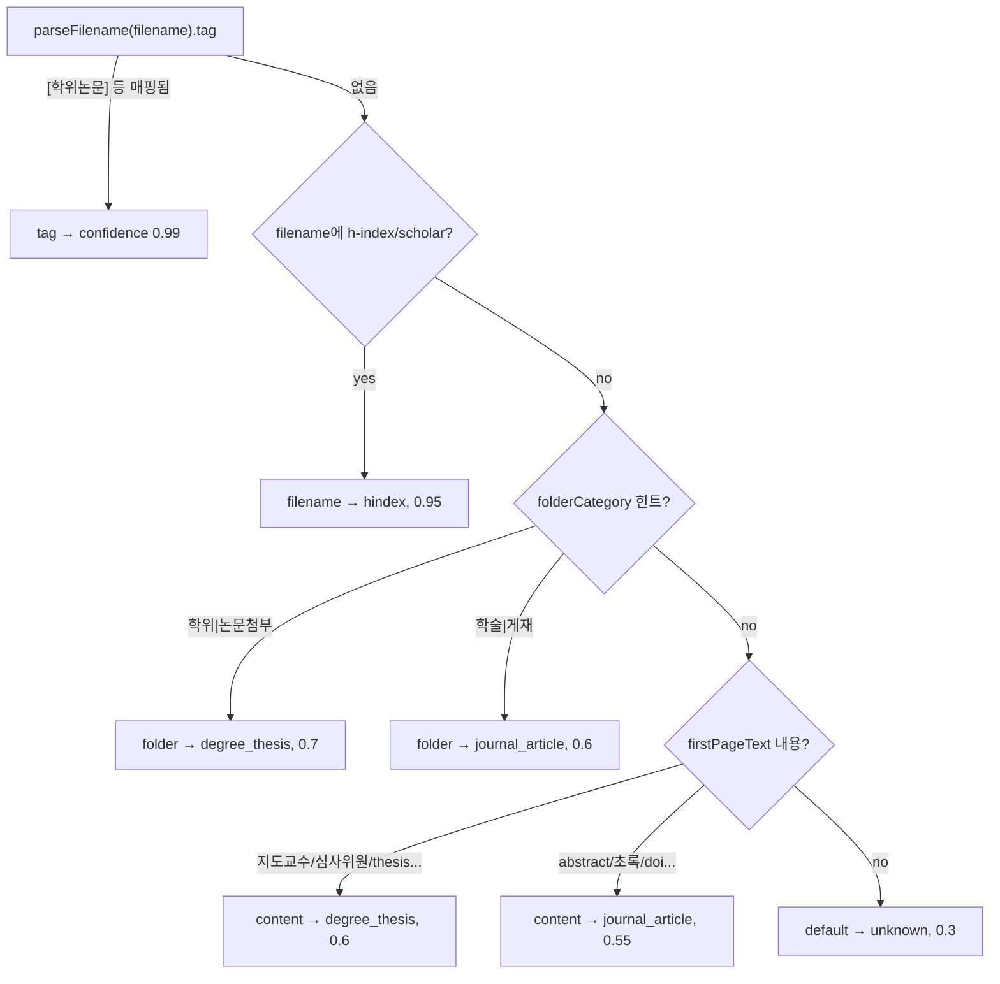

# 4단 파이프라인 상세

이 문서는 Minesweeper 의 핵심 처리 경로인 4단 파이프라인을 단계별로 설명한다. 각 단계는
독립된 모듈로 구현되어 있고, 단계 사이의 계약(contract)은 전부 명시적 TypeScript 타입으로
고정되어 있다. 코드 경로는 모두 `src/lib/pipeline/` 하위다.

관련 문서:

- 추출기(Stage 3) 내부는 별도 문서에서 다룬다 → [./extractors.md](./extractors.md)
- 이름 정규화·동일인 판정 로직 → [./names-and-matching.md](./names-and-matching.md)
- DB 스키마·`SourceRef`·영속 모델 → [./data-model.md](./data-model.md)

---

## 0. 설계 원칙: 두 개의 직교 축

이 시스템의 출발점은 "형식(format)"과 "문서유형(doc-type)"을 **별개의 축**으로 본다는 것이다.

- **형식(`SourceFormat`)** — 파일을 어떻게 *읽는가*. `pdf | image | hwp | text`.
- **문서유형(`DocType`)** — 그 안에서 무엇을 *추출하는가*. `degree_thesis | representative_research | journal_article | hindex | unknown`.

이 분리가 파이프라인의 형태를 결정한다.

```
            ┌──────────┐   ┌──────────┐   ┌───────────┐   ┌────────────┐
  file ───▶ │ 1. Ingest│──▶│ 2. Type  │──▶│ 3. Extract│──▶│ 4. Aggregate│──▶ AggregatedPerson[]
            └──────────┘   └──────────┘   └───────────┘   └────────────┘
              형식차이만        문서유형                       사람 단위로
              여기서 흡수       여기서 결정      (extractors.md)   합치기
```

| 단계 | 모듈 | 입력 | 출력 | 차이를 흡수하는 곳 |
| --- | --- | --- | --- |
| 1. Ingest | `ingest/index.ts` | `filepath`, `SourceFormat?` | `IngestResult` | **형식차이는 여기서만** |
| 2. Type | `classify.ts` | filename / folder / 1p text | `Classification` | — |
| 3. Extract | `extract/*` | `ExtractInput` | `RawPerson[]` | **문서유형차이는 여기서만** |
| 4. Aggregate | `aggregate.ts` | `PersonWithSource[]` | `AggregatedPerson[]` | — |

즉 새 파일 형식(예: pptx)을 더해도 Stage 3·4 는 손대지 않는다. 새 문서유형(예: 특허)을
더해도 Stage 1·2 의 어댑터는 손대지 않는다. 확장 가이드는 본문 끝에 정리한다.

모든 타입은 `src/lib/pipeline/types.ts` 한 파일에 모여 있다. 도메인 enum(`Role`, `DocType`,
`SourceFormat`, `SourceKind`, `Bbox`, `SourceRef`)은 `src/lib/domain.ts` 에서 import 한다.

---

## Stage 1 — Ingest (형식 → 형식-무관 페이지 묶음)

### 책임

어떤 형식의 파일이든 받아서 **형식-무관(format-agnostic)** 한 페이지 묶음으로 정규화한다.
이후 단계는 PDF인지 PNG인지 신경 쓰지 않는다. 텍스트 레이어가 있으면 그걸 꺼내고, 없으면
"비전 필요"로 표시할 뿐 **절대 throw 하지 않는다** — graceful degrade 가 핵심 규약이다.

### 입출력 타입 시그니처

```ts
// src/lib/pipeline/types.ts
export interface PageBundle {
  pageNumber: number;
  text: string;
  hasText: boolean;
  /** Path to a page image (for image formats / scanned pages) — used for vision + crops. */
  imagePath?: string;
}

export interface IngestResult {
  format: SourceFormat;
  filepath: string;
  pages: PageBundle[];
  pageCount: number;
  hasTextLayer: boolean;
  /** Human-readable note, e.g. "scanned: no text layer" or "hwp: unsupported". */
  note?: string;
}
```

```ts
// src/lib/pipeline/ingest/index.ts
export async function ingest(filepath: string, format?: SourceFormat): Promise<IngestResult>
```

### 디스패치

`ingest()` 는 `format` 인자를 우선 쓰고, 없으면 `detectFormat(filepath)` 로 확장자 기반
판정을 한다. 그 다음 형식별 어댑터로 분기한다.

```ts
// src/lib/pipeline/ingest/index.ts
const fmt = format ?? detectFormat(filepath);
switch (fmt) {
  case 'pdf':   return ingestPdf(filepath);   // async
  case 'image': return ingestImage(filepath); // sync
  case 'hwp':   return ingestHwp(filepath);   // sync (placeholder)
  case 'text':  return ingestText(filepath);  // sync
  default:      /* unknown → image 취급, note 기록 */
}
```

`fmt` 가 `null`(미지원 확장자)이면 던지지 않고 **image 로 간주**하여 비전 경로로 흘려보낸다.
이때 `note: "unknown format for <path>; treated as image"` 가 남는다.

### `detectFormat` — 확장자 매핑

```ts
// src/lib/pipeline/ingest/detect.ts
export function detectFormat(filename: string): SourceFormat | null
```

| 확장자 | 결과 |
| --- | --- |
| `.pdf` | `pdf` |
| `.hwp`, `.hwpx` | `hwp` |
| `.txt`, `.text`, `.md` | `text` |
| `.png .jpg .jpeg .webp .gif .bmp .tif .tiff` | `image` |
| 그 외 | `null` |

설계 메모: `detect.ts` 는 **어떤 어댑터도 import 하지 않는다**(특히 pdfjs). 이유는 Next 업로드
라우트처럼 *형식 판정만* 필요한 호출자가 무겁고 ESM-only 인 pdf 어댑터를 번들에 끌어들이지
않게 하기 위함이다. 그래서 `ingest/index.ts` 가 `detectFormat` 을 re-export 한다.

### 어댑터별 동작

#### (a) `ingestPdf` — 텍스트 레이어 추출 + 스캔 graceful degrade

```ts
// src/lib/pipeline/ingest/pdf.ts
export async function ingestPdf(filepath: string): Promise<IngestResult>
```

상수:

- `MAX_PAGES = 100` — 파싱하는 최대 페이지 수(`pageCount` 는 실제 전체 페이지 수를 보고하되
  순회는 `Math.min(doc.numPages, MAX_PAGES)` 까지만).
- `MIN_TEXT_CHARS = 12` — 페이지 텍스트가 이 미만이면 "쓸만한 텍스트 레이어 없음"으로 본다.

pdfjs 로딩은 lazy + 모듈 캐시(`pdfjsPromise`)다. legacy 빌드(`pdfjs-dist/legacy/build/pdf.mjs`)를
메인 스레드의 "fake worker" 로 돌린다. `GlobalWorkerOptions.workerSrc` 해석이 실패해도
`try/catch` 로 삼키고 진행한다(아래 degrade 로 안전하게 빠진다).

페이지별 처리:

```ts
const content = await page.getTextContent();
const text = content.items
  .map((it) => it.str ?? '')
  .join(' ')
  .replace(/\s+/g, ' ')   // 공백 정규화
  .trim();
const hasText = text.length >= MIN_TEXT_CHARS;
if (hasText) hasTextLayer = true;
pages.push({ pageNumber: i, text, hasText });
```

반환:

- 텍스트가 한 페이지라도 있으면 `hasTextLayer: true`, `note` 없음.
- 전부 비었으면 `hasTextLayer: false`, `note: "scanned: no text layer (vision required)"`.
  → 스캔 PDF 는 **던지지 않고** 비전/사람 검토로 라우팅된다.

엣지케이스 — **손상/읽기불가 PDF**:

```ts
catch (err) {
  return {
    format: 'pdf', filepath,
    pages: [{ pageNumber: 1, text: '', hasText: false, imagePath: filepath }],
    pageCount: 1, hasTextLayer: false,
    note: `pdf parse failed: ${(err as Error).message}`,
  };
}
```

파싱 자체가 실패하면 단일 비전 페이지(이미지 경로 = 원본 PDF 경로)로 degrade 한다. 파이프라인은
멈추지 않는다.

> 구현 디테일: `readFile` 한 버퍼를 `new Uint8Array(buf)` 로 **복사**해 넘긴다. pdfjs 가 내부적으로
> underlying buffer 를 detach 하는 것을 막기 위함이다.

#### (b) `ingestImage` — 이미 페이지 이미지

```ts
// src/lib/pipeline/ingest/image.ts
export function ingestImage(filepath: string): IngestResult
```

이미지(예: 구글 스칼라 h-index 캡처)는 그 자체가 1장의 페이지 이미지다. 텍스트 추출 없이 바로
비전이 처리하도록 단일 `PageBundle` 을 만든다.

```ts
pages: [{ pageNumber: 1, text: '', hasText: false, imagePath: filepath }],
pageCount: 1, hasTextLayer: false,
note: 'image: vision required',
```

#### (c) `ingestText` — 플레인 텍스트

```ts
// src/lib/pipeline/ingest/text.ts
export function ingestText(filepath: string): IngestResult
```

`text/plain` 첨부의 어댑터이자, **테스트에서 알려진 텍스트를 파이프라인에 주입하는 가장 단순한
경로**다. 동기 `readFileSync`(utf8)를 쓰고, 읽기 실패 시 빈 문자열로 degrade 한다.

정규화: `\r\n → \n`, 줄 끝 공백 제거(`[ \t]+\n → \n`), 양끝 `trim()`. `hasText`/`hasTextLayer`
는 정규화 결과 길이가 0 보다 큰지로 정한다. 항상 단일 페이지(`pageNumber: 1`).

#### (d) `ingestHwp` — HWP 5.x + HWPX 텍스트 추출

```ts
// src/lib/pipeline/ingest/hwp.ts
export function ingestHwp(filepath: string): IngestResult
```

**순수 Node**(의존성: `cfb` + 내장 `zlib` + `adm-zip`, 네이티브/외부변환/sudo 불필요)로 HWP 텍스트를 뽑는다.

- **`.hwp`(구형 바이너리, CFB/OLE)**: `cfb`로 컨테이너를 열고 `FileHeader`의 압축 플래그를 확인 →
  `BodyText/Section*` 스트림을 `zlib.inflateRawSync`로 풀고 `HWPTAG_PARA_TEXT`(67) 레코드의 UTF-16LE
  텍스트를 파싱(인라인/확장 컨트롤은 8 wchar로 스킵). 라이브 실파일(33MB/153p)에서 약 15만 자, 연구진
  인명까지 정확 추출 확인.
- **`.hwpx`(OWPML zip)**: `adm-zip`으로 `Contents/section*.xml`의 `<hp:t>` 런 텍스트를 추출(엔티티 디코드).
- 실패 시 빈 결과 + `note` 로 graceful → Stage 3 가 건너뛰고, 텍스트가 없으면 `needs_vision` 으로 사람 검토.

> 도장/수기 서명 **자동 감지**는 HWP 페이지 렌더링이 필요해 현재 범위 밖이다. 텍스트가 없는(스캔형)
> HWP는 `needs_vision` 플래그로 사람이 원문을 확인한다. (추측으로 이름을 지어내지 않는다.)

### Stage 1 어댑터 요약

| 어댑터 | 동기/비동기 | `pages` | `hasTextLayer` | `imagePath` | `note` |
| --- | --- | --- | --- | --- | --- |
| pdf (텍스트 있음) | async | n페이지(텍스트) | `true` | 없음 | 없음 |
| pdf (스캔) | async | n페이지(빈 텍스트) | `false` | 없음 | `scanned: ...` |
| pdf (파싱실패) | async | 1(이미지=원본) | `false` | 원본 경로 | `pdf parse failed: ...` |
| image | sync | 1(이미지) | `false` | 원본 경로 | `image: vision required` |
| text | sync | 1(텍스트) | 내용 유무 | 없음 | 없음 |
| hwp | sync | `[]` | `false` | 없음 | `hwp/hwpx not supported ...` |
| unknown | (image로) | 1(이미지) | `false` | 원본 경로 | `unknown format ...` |

---

## Stage 2 — Type (문서유형 분류)

### 책임

문서가 학위논문인지, 대표연구실적인지, 학술논문인지, h-index 캡처인지 판정한다. 이 결과가
Stage 3 추출기의 동작(어떤 역할을 기대하고 어떻게 파싱할지)을 결정한다.

### 입출력 타입 시그니처

```ts
// src/lib/pipeline/classify.ts
export interface Classification {
  docType: DocType;
  method: 'tag' | 'filename' | 'folder' | 'content' | 'default';
  confidence: number;
}

export function classifyDocType(input: {
  filename: string;
  folderCategory?: string | null;
  firstPageText?: string | null;
}): Classification
```

`method` 필드는 *왜* 그렇게 분류했는지의 출처이고, `confidence` 는 그 신호의 강도다.

### 우선순위 알고리즘: `tag > filename > folder > content > default`

분류는 신뢰도가 높은 신호부터 순서대로 시도하고, 먼저 맞는 것을 즉시 반환한다.



#### 1순위 — 파일명 `[tag]` (confidence 0.99)

`parseFilename` (→ [filename 규약](./names-and-matching.md))이 뽑은 bracket 태그를 doc-type 으로
직매핑한다. 파일 명명 규약상 `<id>_[<tag>]_<title>` 의 `[tag]` 가 거의 100% doc-type 을 결정한다.

```ts
const TAG_TO_DOCTYPE: Record<string, DocType> = {
  학위논문: 'degree_thesis',
  대표연구실적: 'representative_research',
  학술논문: 'journal_article',
};
```

#### 2순위 — 파일명 키워드 (confidence 0.95)

태그가 없을 때, 소문자화한 파일명에 `/h[\s_-]?index|scholar/` 가 매치되면 `hindex`.

#### 3순위 — 폴더 힌트 (confidence 0.7 / 0.6)

`folderCategory` 에 대해:

- `/학위|논문첨부/` → `degree_thesis` (0.7)
- `/학술|게재/` → `journal_article` (0.6)

#### 4순위 — 1페이지 내용 fallback (confidence 0.6 / 0.55)

`firstPageText` 가 있으면 본문 키워드로 추정한다.

- `/지도\s*교수|심사\s*위원|위원장|학위\s*논문|dissertation|thesis advisor|committee member/i`
  → `degree_thesis` (0.6)
- `/abstract|초록|keywords|저자|authors?|©|doi:/i` → `journal_article` (0.55)

#### 5순위 — default (confidence 0.3)

아무 신호도 없으면 `{ docType: 'unknown', method: 'default', confidence: 0.3 }`.

### 엣지케이스

- 태그가 있어도 `TAG_TO_DOCTYPE` 에 없는 값이면 1순위를 건너뛰고 다음 신호로 내려간다.
- `representative_research` 와 `unknown` 은 본문/폴더 fallback 으로는 절대 나오지 않는다 — 오직
  파일명 태그(`대표연구실적`)와 default 에서만 각각 등장한다.
- `firstPageText` 는 보통 Stage 1 이 만든 첫 텍스트 페이지에서 온다(아래 오케스트레이션 참조).
- 스캔/이미지/hwp 처럼 텍스트가 없는 문서는 1~3순위에서 안 걸리면 보통 `unknown` 으로 떨어진다.

---

## Stage 3 — Extract (인터페이스 수준)

> Stage 3 의 구현(stub / vlm, 프롬프트, 역할 매핑)은 [./extractors.md](./extractors.md) 에서 상세히
> 다룬다. 여기서는 파이프라인과의 **계약**만 본다.

추출기는 pluggable 인터페이스다. 구현은 결정론적 `stub`(기본·테스트)과 온프레 `vlm`(기본
Ollama qwen3.5:9B) 두 가지다.

```ts
// src/lib/pipeline/types.ts
export interface ExtractInput {
  docType: DocType;
  pages: PageBundle[];
  filename: string;
  selfName?: string;       // 본인 이름 — is_self 태깅용
  imagePaths?: string[];   // 비전 추출용 페이지 이미지(스캔 PDF / hindex)
}

export interface Extractor {
  readonly name: string;
  extract(input: ExtractInput): Promise<RawPerson[]>;
}

export interface RawPerson {
  nameRaw: string;
  role: Role;
  affiliation?: string | null;
  sourceKind: SourceKind;     // printed | handwritten | seal | signature
  sourcePage: number;
  confidence: number;          // 0..1
  isSelf?: boolean;
  regionBbox?: Bbox | null;
  ocrEngine?: string | null;
  ocrConfidence?: number | null;
  evidence?: string;           // 이름이 나온 줄/스니펫(provenance)
}
```

추출기 선택은 환경변수로:

```ts
// src/lib/pipeline/extract/index.ts
export function getExtractor(mode: string = process.env.EXTRACTOR_MODE ?? 'stub'): Extractor {
  return mode === 'vlm' ? new VlmExtractor() : new StubExtractor();
}
```

Stage 3 의 출력 `RawPerson[]` 은 오케스트레이터가 문서 출처(`documentId`, `filename`, `docType`)를
덧붙여 `PersonWithSource[]` 로 만든 뒤 Stage 4 에 넘긴다.

---

## Stage 4 — Aggregate (occurrence → person)

### 책임

여러 문서에 흩어진 같은 사람의 **occurrence(등장)** 들을 *한 명의 실제 사람* 한 행으로 합친다.
역할은 **합집합**으로 모으고, provenance(`SourceRef`)는 전부 수집하며, 지원자 본인은 플래그한다.
병합은 **보수적**으로 — 애매한 이름은 합치지 않고 따로 둔다(자세한 매칭 규칙은
[./names-and-matching.md](./names-and-matching.md)).

### 입출력 타입 시그니처

```ts
// src/lib/pipeline/types.ts
export interface PersonWithSource extends RawPerson {
  documentId: string;
  filename: string;
  docType: DocType;
}

export interface AggregatedPerson {
  canonicalName: string;
  nameNormalized: string;
  roles: Role[];
  sources: SourceRef[];        // import('@/lib/domain').SourceRef[]
  affiliation: string | null;
  isSelf: boolean;
  needsHuman: boolean;
}
```

```ts
// src/lib/pipeline/aggregate.ts
export interface AggregateOptions {
  selfName?: string;            // 지원자 이름 — 매칭되면 is_self 로 자동 제외 표시
  confidenceThreshold?: number;
}

export function aggregate(
  persons: PersonWithSource[],
  options: AggregateOptions = {},
): AggregatedPerson[]
```

### 임계값

```ts
const CONFIDENCE_THRESHOLD = 0.7;   // 이 미만의 추출 신뢰도는 사람 검토로 라우팅
```

`options.confidenceThreshold` 로 덮어쓸 수 있고, 기본은 `0.7` 이다.

### 알고리즘

각 `PersonWithSource` 를 순회하며 기존 그룹에 붙이거나 새 그룹을 만든다.

```ts
let group = groups.find((g) => g.members.some((m) => namesMatch(m.nameRaw, p.nameRaw)));
```

그룹 매칭은 `names.namesMatch` 로 한다(보수적 동일인 판정 — [names-and-matching.md](./names-and-matching.md)).
매칭 그룹이 없으면 새 `Group` 을 만든다.

각 occurrence 를 그룹에 합칠 때:

1. **역할 합집합** — `group.roles.add(p.role)` (`Set<Role>`).
2. **provenance 수집** — `group.sources.push({...})` 로 `SourceRef` 추가:

   ```ts
   group.sources.push({
     documentId: p.documentId,
     filename: p.filename,
     docType: p.docType,
     page: p.sourcePage,
     role: p.role,
     sourceKind: p.sourceKind,
     confidence: p.confidence,
     evidence: p.evidence,
   });
   ```

3. **affiliation** — 아직 없고 occurrence 에 있으면 첫 값으로 채운다(`if (!group.affiliation && p.affiliation)`).
4. **canonical 이름 선정** — `nameCompleteness(p.nameRaw)` 점수가 가장 높은 occurrence 의
   `nameRaw` 를 `bestName` 으로 유지한다(가장 "완전한" 표기를 대표명으로).
5. **본인 플래그** — `if (p.isSelf) group.isSelf = true`.
6. **needsHuman 임계** —
   ```ts
   if (p.sourceKind !== 'printed' || p.confidence < threshold) group.needsHuman = true;
   ```
   즉 **printed 가 아니거나**(손글씨/도장/서명) **신뢰도가 0.7 미만**이면 그 그룹 전체가
   사람 검토 대상이 된다.

마지막에 그룹을 `AggregatedPerson` 으로 매핑한다.

```ts
const isSelf =
  g.isSelf || (selfName ? g.members.some((m) => namesMatch(m.nameRaw, selfName)) : false);
const canonicalName = normalizeName(g.bestName);
return {
  canonicalName,
  nameNormalized: canonicalName,
  roles: [...g.roles],
  sources: g.sources,
  affiliation: g.affiliation,
  isSelf,
  needsHuman: g.needsHuman,
} satisfies AggregatedPerson;
```

- `isSelf` 는 추출기가 표시한 `p.isSelf` **또는** `selfName` 이 그룹 멤버 중 누구와 매칭되면 true.
- `canonicalName` 과 `nameNormalized` 둘 다 `normalizeName(bestName)` 결과다(현재 동일 값).

### `needsHuman` 결정 표

| 조건 | needsHuman |
| --- | --- |
| 모든 occurrence 가 `printed` 이고 모두 confidence ≥ 0.7 | `false` |
| occurrence 중 하나라도 `handwritten`/`seal`/`signature` | `true` |
| occurrence 중 하나라도 confidence < threshold(기본 0.7) | `true` |

> `needsHuman` 은 그룹 단위로 OR 누적된다 — 한 occurrence 만 문제여도 그 사람 전체가 검토 대상.

### 엣지케이스

- **빈 입력** — `aggregate([])` 은 `[]` 를 반환(그룹이 없으므로).
- **`selfName` 없음** — `g.isSelf`(추출기가 표시한 것)만으로 본인 판정.
- **보수적 병합** — 동명이인/약어처럼 애매하면 `namesMatch` 가 false 를 내 그룹이 갈라진 채로 둔다.
  이름을 임의로 합쳐 잘못된 이해충돌을 만들기보다 따로 두는 쪽을 택한다.
- **affiliation 충돌** — 같은 사람의 서로 다른 소속이 들어와도 *첫 번째* 비어있지 않은 값만 채택한다.

---

## runPipeline — 4단 오케스트레이션

### 시그니처

```ts
// src/lib/pipeline/run.ts
export interface PipelineFile {
  filepath: string;
  folderCategory?: string | null;
  documentId?: string;       // 워커는 DB row id 를 넘김; 테스트는 생략 가능
}

export interface RunOptions {
  applicantName?: string;
  /** Defaults to the env-selected extractor (stub unless EXTRACTOR_MODE=vlm). */
  extractor?: Extractor;
}

export interface DocResult {
  documentId: string;
  filepath: string;
  filename: string;
  folderCategory: string | null;
  docType: DocType;
  ingest: IngestResult;
  persons: PersonWithSource[];
}

export interface PipelineResult {
  documents: DocResult[];
  aggregates: AggregatedPerson[];
}

export async function runPipeline(
  files: PipelineFile[],
  options: RunOptions = {},
): Promise<PipelineResult>
```

### 흐름

```
runPipeline(files, options)
  extractor = options.extractor ?? getExtractor()       // ── 추출기 주입(DI)
  for each file:
    filename   = basename(file.filepath)
    documentId = file.documentId ?? `doc-${++autoId}`   // ── 없으면 자동 id 부여
    ing        = await ingest(file.filepath, detectFormat(filename) ?? undefined)   // Stage 1
    firstPageText = ing.pages.find(p => p.hasText)?.text ?? ing.pages[0]?.text ?? ''
    docType    = classifyDocType({ filename, folderCategory, firstPageText }).docType // Stage 2
    imagePaths = ing.pages.map(p => p.imagePath).filter(Boolean)
    raw        = await extractor.extract({ docType, pages, filename, selfName, imagePaths }) // Stage 3
    persons    = raw.map(r => ({ ...r, documentId, filename, docType }))  // → PersonWithSource
    allPersons.push(...persons)
    documents.push({ documentId, ..., docType, ingest: ing, persons })
  aggregates = aggregate(allPersons, { selfName: applicantName })          // Stage 4
  return { documents, aggregates }
```

핵심 포인트:

- **extractor 주입(DI)** — `options.extractor ?? getExtractor()`. 테스트는 결정론적 stub 이나
  fake 를 직접 주입할 수 있고, 운영 워커는 env(`EXTRACTOR_MODE`)가 고른 것을 쓴다.
- **documentId 자동 부여** — 워커는 DB row id 를 넘기지만, 없으면 `doc-1`, `doc-2`… 로 채번한다.
- **firstPageText 선택** — `hasText` 인 첫 페이지의 텍스트, 없으면 첫 페이지의 (빈) 텍스트, 그것도
  없으면 빈 문자열. 이게 Stage 2 의 content fallback 입력이 된다.
- **imagePaths 전달** — `imagePath` 가 있는 페이지(스캔 PDF/이미지/hindex)만 모아 추출기에 비전
  입력으로 넘긴다.
- **selfName 흐름** — `options.applicantName` 이 Stage 3 의 `selfName`(is_self 태깅)과 Stage 4 의
  `aggregate(..., { selfName })`(본인 매칭) 두 곳에 동일하게 전달된다.
- **Stage 4 입력** — Stage 3 가 낸 `RawPerson` 에 `{ documentId, filename, docType }` 을 더해
  `PersonWithSource` 로 만든 전체 목록을 한 번에 집계한다.

반환된 `PipelineResult` 는 per-document 결과(`documents`)와 사람 단위 집계(`aggregates`)를 모두
담는다. 영속화/검토 UI 가 이 둘을 어떻게 쓰는지는 [./data-model.md](./data-model.md) 참고.

---

## 확장 가이드

### 새 **형식** 추가 (Stage 1 만 손댄다)

예: `.pptx` 지원.

1. `src/lib/domain.ts` 의 `SOURCE_FORMATS` 에 `'pptx'` 추가(필요 시) → `SourceFormat` 자동 확장.
2. `src/lib/pipeline/ingest/detect.ts` 에 확장자 매핑 추가:
   ```ts
   if (ext === '.pptx') return 'pptx';
   ```
3. `src/lib/pipeline/ingest/pptx.ts` 에 `ingestPptx(filepath): IngestResult | Promise<IngestResult>`
   구현 — 반드시 `IngestResult` 계약을 따르고, 텍스트 없으면 `imagePath` 로 비전 페이지를 만들며,
   **throw 하지 말고 graceful degrade** 한다(`note` 기록).
4. `src/lib/pipeline/ingest/index.ts` 의 `switch` 에 `case 'pptx': return ingestPptx(filepath);` 추가.

Stage 2·3·4 는 변경 불필요 — 이들은 `IngestResult` 만 본다(형식차이는 Stage 1 에서 흡수됨).

### 새 **문서유형** 추가 (Stage 2 + Stage 3)

예: 특허(`patent`).

1. `src/lib/domain.ts` 의 `DOC_TYPES` 에 `'patent'` 추가 → `DocType` 자동 확장. (`DOC_TYPE_LABELS_KO`
   라벨도 같이 추가.)
2. `src/lib/pipeline/classify.ts` 에서 분류 신호 추가:
   - 파일명 태그면 `TAG_TO_DOCTYPE` 에 `특허: 'patent'`,
   - 또는 폴더/내용 정규식 분기 추가(우선순위 위치 유의).
3. 추출기에서 해당 doc-type 의 추출 규칙 추가 → [./extractors.md](./extractors.md) 의 확장 절 참조.

Stage 1·4 는 변경 불필요 — Ingest 는 형식만 알면 되고, Aggregate 는 doc-type-agnostic 하게 역할을
합집합으로 모은다(문서유형차이는 Stage 3 에서 흡수됨).

### 새 **추출기** 추가 (Stage 3)

`Extractor` 인터페이스(`name`, `extract(input): Promise<RawPerson[]>`)를 구현하고
`getExtractor` 의 분기에 모드를 추가하거나, `runPipeline(files, { extractor: myExtractor })` 로
직접 주입한다. 상세는 [./extractors.md](./extractors.md).

---

## 불변 원칙 (전 단계 공통)

- **자동추출은 초안, 최종판단은 사람.** `needsHuman`/`note`/flag 로 표시할 뿐, 시스템이 단독으로
  이해충돌을 확정하지 않는다.
- **절대 이름을 지어내지 않는다.** 읽을 수 없으면(hwp placeholder, 스캔, 파싱실패) 비전/사람
  검토로 라우팅하지, 빈칸을 추측으로 채우지 않는다.
- **graceful degrade.** Stage 1 어댑터는 던지지 않는다 — 한 문서의 실패가 배치 전체를 멈추지 않게.
