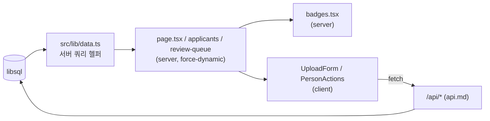
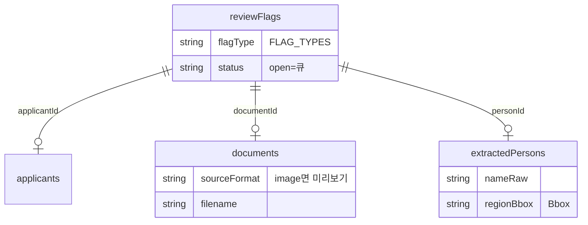

# 검토 UI·디자인

이 문서는 Minesweeper 의 검토 화면(웹 UI)을 다룬다. **자동 추출은 초안이고 최종 판단은 사람이 한다**는
원칙을 화면이 어떻게 구현하는지 — 쉬운 건 자동 통과시키고 애매한 건 한곳에 모아 보여주는 흐름 — 을
페이지·컴포넌트·디자인 토큰·서버 쿼리 순으로 정리한다.

코드 인용은 모두 실제 파일에서 가져왔다. 데이터가 들어오는 API 계약은 [./api.md](./api.md),
파일 서빙·내보내기·접근 통제는 [./security.md](./security.md) 를 참고하라.

---

## 0. 전체 구조 한눈에

App Router(Next.js 14) 기반이며, 검토 화면은 모두 **서버 컴포넌트 + `force-dynamic`** 으로 매 요청마다
DB 를 다시 읽는다. 사용자 인터랙션(업로드 폴링, 확인/수정/제외)이 필요한 두 군데만 `'use client'` 다.

```
src/app/
├─ layout.tsx              ⛏️ 헤더(지원자 / 검토 필요 큐) + 푸터, globals.css 로드
├─ page.tsx                홈: 업로드 + 지원자 목록           [server]
├─ applicants/[id]/page.tsx 지원자별 검토(관계자 표·문서)     [server]
└─ review-queue/page.tsx   검토 필요 큐(flag 필터·크롭 오버레이)[server]

src/components/
├─ UploadForm.tsx          업로드 후 /api/status 폴링         [client]
├─ PersonActions.tsx       확인/수정/제외 → /api/persons     [client]
└─ badges.tsx              ConfidenceBadge·FinalStatusBadge·RoleBadges [server]

src/lib/data.ts            getApplicants / getApplicantReview / getReviewQueue (서버 전용 쿼리)
src/lib/domain.ts          enum + 한국어 라벨맵(*_LABELS_KO)
```

데이터 흐름은 한 방향이다.


```mermaid
flowchart LR
  DB[(libsql)] --> data["src/lib/data.ts<br/>서버 쿼리 헬퍼"]
  data --> page["page.tsx / applicants / review-queue<br/>(server, force-dynamic)"]
  page --> badges["badges.tsx<br/>(server)"]
  page --> client["UploadForm / PersonActions<br/>(client)"]
  client -->|fetch| api["/api/* (api.md)"]
  api --> DB
```

페이지는 절대 DB 를 직접 만지지 않고 `data.ts` 헬퍼만 호출한다. 클라이언트 컴포넌트는 서버 쿼리 대신
`fetch` 로 API 라우트를 호출한다(쓰기·폴링).

---

## 1. 페이지별

### 1.1 루트 레이아웃 — `src/app/layout.tsx`

`metadata.title` 은 `'Minesweeper — 이해충돌 관계자 검토'`. `<html lang="ko">` 로 한국어 문서다.

- **헤더**: `sticky top-0 z-10`, `border-b border-stroke bg-bg`. 좌측 브랜드 `⛏️ Minesweeper`(홈 링크),
  우측 내비 두 개 — `지원자`(`/`), `검토 필요 큐`(`/review-queue`). 둘 다 `seed-btn-ghost`.
- **본문**: `<main className="mx-auto max-w-6xl px-5 py-8">` 로 최대폭 `6xl` 중앙 정렬.
- **푸터**: 원칙을 매 화면 하단에 박아둔다 —

  > 자동 추출은 초안입니다 · 최종 판단은 사람이 합니다

이 한 줄이 디자인 의도의 요약이다. 모든 페이지가 이 프레임 안에서 렌더된다.

### 1.2 홈 — `src/app/page.tsx`

`export const dynamic = 'force-dynamic'` 이고, 서버에서 `getApplicants()` 를 한 번 호출한다.

```tsx
const list = await getApplicants(); // ApplicantSummary[]
```

두 섹션으로 구성된다.

1. **업로드 카드** (`seed-card p-6`): 제목 "지원자 ZIP 업로드", 설명에 4단 파이프라인
   `Ingest → Type → Extract → Aggregate` 을 명시하고 "추출 결과는 초안이며, 사람이 검토·확정합니다"를
   반복한다. 안에 `<UploadForm />` (클라이언트) 을 둔다.
2. **지원자 목록**: 제목 `지원자 ({list.length})`. 비어 있으면 "아직 업로드된 지원자가 없습니다." 카드,
   아니면 `sm:grid-cols-2` 카드 그리드.

각 카드는 `getApplicants` 가 계산한 **카운트/진행 상태**를 그대로 노출한다.

| 표시 | 소스 필드 | 규칙 |
|---|---|---|
| 이름 | `a.name` | 굵게 |
| 미확인 배지 | `a.needsHuman` | `> 0` 이면 `seed-badge-warning` 으로 `미확인 {a.needsHuman}` |
| 검토 가능 배지 | — | `needsHuman === 0` 이면 `seed-badge-success` 로 `검토 가능` |
| 관계자 수 | `a.total` | `관계자 {a.total}명` |
| 회차 | `a.round` | 있으면 `· {a.round}` 덧붙임 |

```tsx
{a.needsHuman > 0 ? (
  <span className="seed-badge-warning">미확인 {a.needsHuman}</span>
) : (
  <span className="seed-badge-success">검토 가능</span>
)}
```

즉 목록 단계에서 이미 "사람 손이 필요한가"를 한눈에 분류한다. `total`/`needsHuman` 은 문자열일 수 있는
집계값이라 `data.ts` 에서 `Number(...)` 로 정규화되어 들어온다(§4).

> **진행률 폴링 vs. 목록 카운트**: 홈 카드의 숫자는 *완료된* 집계(`personAggregates`)를 센 것이고,
> 업로드 *직후* 의 실시간 진행률(%)은 `UploadForm` 이 별도로 `/api/status/{id}` 를 폴링해 보여준다(§2.1).
> 추출이 끝나면 폴링이 종료되고 지원자 상세로 이동하므로, 새로고침된 홈에는 정식 카운트가 반영된다.

### 1.3 지원자별 검토 — `src/app/applicants/[id]/page.tsx`

`getApplicantReview(params.id)` 로 `{ applicant, aggregates, documents, job }` 를 받고, 없으면 `notFound()`.

집계를 두 갈래로 가른다 — **본인 자동 제외**가 이 화면의 첫 번째 신뢰 장치다.

```tsx
const people = aggregates.filter((a) => !a.isSelf);
const self = aggregates.filter((a) => a.isSelf);
```

- **헤더**: 지원자명 + 지원번호(externalId), 검토 필요 건수 배지, 한 줄 안내, `문서 {documents.length}건`, job 상태 인디케이터.
  우측에 내보내기 버튼 두 개:
  - `CSV` → `/api/export/{applicant.id}?format=csv` (`seed-btn-neutral`)
  - `Excel 내보내기` → `/api/export/{applicant.id}?format=xlsx` (`seed-btn-primary`)
- **헤더 아래 StepStrip**: `① 수동 확인 → ② 관계자 검토 → ③ 제척 확정 → ④ 면접위원 초빙` 앵커 링크 스트립. 건수가 있는 단계만 색으로 강조(warning/danger), 목표 단계는 accent.
- **본인 소속 표시**: `selfAffsClean.length > 0` 이면 헤더 안에 동일소속 판정 기준 소속기관을 `seed-badge-neutral` 로 표시한다. 지원자 본인은 관계자 표에서 자동 제외된다(별도 회색 "본인 자동 제외" 카드는 제거됨).

**관계자 표** — 좌측 필터 사이드바(상태: 검토 필요/제척/동일소속 + 역할)와 클라이언트 검색 인풋으로 좁힌 뒤 보여준다(서버 `?view=`/`?q=` 칩에서 클라이언트 체크박스 상태로 이관). 필터·검색이 없으면 역할별 `<details>` 접이식 그룹으로 묶는다. 컬럼:

| 컬럼 | 내용 | 컴포넌트/필드 |
|---|---|---|
| (chevron) | 행 토글 버튼 | 클릭하면 상세 패널 펼침/접음 |
| 이름 | `p.canonicalName` | 굵게; 동명이인 후보가 있으면 후보 병기 |
| 역할 | `ROLE_LABELS_KO` 를 `·` 로 이은 텍스트 | `<RoleBadges roles={p.roles} />` (compact 기본) |
| 상태 | 제척·동일소속·신뢰도·최종상태 배지 | `<ConfidenceBadge>` + `<FinalStatusBadge>` 등 |
| (액션) | 확인/수정/제외 | `<PersonActions>` |

소속·출처는 열에서 빠지고 **행 토글 상세 패널**(`PersonDetail`) 안으로 옮겨졌다(소속, 출처, 그리고 제척이면 전문가 풀 일치 상세). 결과가 0명이면 표 대신 안내 문구를 가운데 정렬로 보여준다.

**출처 링크 + evidence 스니펫** — 출처는 관계자 표의 열이 아니라 **행 토글 상세 패널**(`PersonDetail`)의 "출처" 섹션에 렌더된다. 각 `source` 는 원문 파일로 새 탭 링크되고, 호버 `title` 로 근거를 보여준다.

```tsx
{p.sources.map((s, i) => (
  <a
    key={`${s.documentId}-${i}`}
    href={`/api/file/${s.documentId}`}
    target="_blank"
    rel="noreferrer"
    title={s.evidence ?? s.filename}
    className="whitespace-nowrap text-info underline-offset-2 hover:underline"
  >
    {DOC_TYPE_LABELS_KO[s.docType]} p.{s.page}
  </a>
))}
```

링크 텍스트는 문서유형 한국어 라벨 + 페이지(예: `학위논문 p.3`). `s.evidence` 는 이름이 추출된 줄/스니펫으로,
`SourceRef.evidence?` 필드(아래 `domain.ts`)에서 온다 — "왜 이 이름이 뽑혔는가"를 호버 한 번으로 확인.
파일 서빙(`/api/file/{documentId}`)의 접근 통제는 [./security.md](./security.md) 참고.

```ts
// src/lib/domain.ts — 출처에 따라붙는 근거
export interface SourceRef {
  documentId: string; filename: string; docType: DocType;
  page: number; role: Role; sourceKind: SourceKind; confidence: number;
  /** The line/snippet the name came from (shown as a hover snippet in the review UI). */
  evidence?: string;
}
```

**노랑 '미확인' 배지** — 상태 셀은 제척·동일소속·신뢰도·최종상태 배지를 `flex-col items-start` 로 쌓는다(`PersonRow`).

```tsx
<td className="px-3 py-3">
  <div className="flex flex-col items-start gap-1">
    {conflicted && <span className="seed-badge-danger">제척</span>}
    {sameAff[p.id] && <span className="seed-badge-warning">동일소속</span>}
    <ConfidenceBadge needsHuman={p.needsHuman} />
    <FinalStatusBadge status={p.finalStatus} />
  </div>
</td>
```

- `ConfidenceBadge`: `needsHuman=true` 일 때만 노랑 **미확인** 을 렌더하고, `false` 면 `null`(배지 없음 — 초록 '자동 통과' 배지 제거, §2.3).
- `FinalStatusBadge`: 사람이 손댄 결과(`confirmed`/`rejected`/`edited`). `pending` 이면 아무것도 안 그린다.
- `block` 대신 `flex-col items-start` 를 쓰는 이유: 배지가 내용 너비만 차지하게 해, 넓어진 상태 열을 가득 채워 빨강이 형광펜처럼 칠해지는 것을 막는다.

**정렬 규칙**(서버 쿼리, §4): `isSelf → needsHuman DESC → canonicalName`. 즉 본인 다음에 *손이 필요한*
사람이 위로, 그 안에서 가나다순. 검토자가 위에서부터 처리하면 애매한 것부터 끝난다.

**문서 섹션**: 하단에 `documents` 를 `sm:grid-cols-2` 카드로 — 파일명(truncate) + 문서유형 배지
(`seed-badge-neutral`, `DOC_TYPE_LABELS_KO[d.docType]`).

### 1.4 검토 필요 큐 — `src/app/review-queue/page.tsx` (+ `board.tsx`)

이 화면이 "애매한 것 모아보기"의 실체다. `getReviewQueue()` 로 *열린*(`status='open'`) 플래그 전부를 받아온다.

`getReviewQueue()` 로 서버에서 전체 큐 항목을 가져온 뒤 `<ReviewQueueBoard>`(클라이언트 컴포넌트, `src/app/review-queue/board.tsx`)에 통째로 넘긴다(`page.tsx` 는 데이터 패칭만 하는 서버 컴포넌트).

**좌측 필터 사이드바**(당근마켓 스타일, `lg:sticky`) — 서버 URL 파라미터 칩이 아니라 **클라이언트 상태** 기반 다중 선택 체크박스다.

- **유형** 그룹: `flagType` 별 체크박스(카운트 표시). 그룹 내 OR.
- **지원자** 그룹: `applicantId` 별 체크박스(지원자명 표시, 카운트 내림차순). 그룹 내 OR.
- 그룹 간 AND, 즉시(클라이언트) 필터링, 초기화 버튼 제공. 카운트는 전체 모집단 기준 고정(필터를 바꿔도 옵션 카운트가 깜빡이지 않음).

```tsx
// board.tsx 핵심 필터 로직 — 그룹 내 OR, 그룹 간 AND
const filtered = items.filter(
  (it) =>
    (flagSel.size === 0 || flagSel.has(it.flag.flagType)) &&
    (appSel.size === 0 || appSel.has(it.applicantId)),
);
```

**내보내기**: 유형을 정확히 하나 골랐을 때만 `?flag=` 파라미터를 붙이고, 그 외(다중·없음)에는 전체를 내보낸다(지원자 필터는 내보내기에 반영되지 않음).

```tsx
const exportHref =
  flagSel.size === 1
    ? `/api/review-queue/export?flag=${encodeURIComponent([...flagSel][0])}`
    : '/api/review-queue/export';
```

유형 라벨은 `FLAG_TYPE_LABELS_KO`:

| flagType | 라벨(`FLAG_TYPE_LABELS_KO`) |
|---|---|
| `seal` | 도장 |
| `handwriting` | 손글씨 |
| `signature` | 서명 |
| `low_confidence` | 저신뢰 |
| `ambiguous` | 동명이인/약어 |
| `needs_vision` | 비전 판독 필요 |

**카드 그리드** (`sm:grid-cols-2 lg:grid-cols-3`). 각 카드 위쪽은 `aspect-[4/3]` 미리보기 영역.

**bbox 크롭 오버레이** — 이미지 출처이고 `documentId` 가 있으면 원문 이미지를 `object-contain` 으로 깔고,
`bbox` 가 있으면 추출 영역을 캐럿 테두리 + 반투명 채움으로 덮는다. `bbox` 좌표는 0..1 정규화 비율을
`%` 로 환산한다.

```tsx
{it.bbox && (
  <div
    className="pointer-events-none absolute border-2 border-accent"
    style={{
      left: `${it.bbox.x * 100}%`,
      top: `${it.bbox.y * 100}%`,
      width: `${it.bbox.w * 100}%`,
      height: `${it.bbox.h * 100}%`,
      backgroundColor: 'rgba(255, 111, 15, 0.18)', // 캐럿 #ff6f0f 18% 채움
    }}
  />
)}
```

이미지가 아니거나 문서가 없으면 "미리보기 없음" 플레이스홀더. 채움색 `rgba(255, 111, 15, ...)` 은
`--seed-accent`(#ff6f0f)와 같은 캐럿이다 — 토큰과 인라인 스타일이 동일 색을 가리킨다.

**카드 본문**:
- flag 타입 노랑 배지(`seed-badge-warning`, `FLAG_TYPE_LABELS_KO`).
- `원문 보기` 링크 → `/api/file/{documentId}` 새 탭.
- 제목 `it.personName ?? it.filename ?? '문서'` (truncate).
- 지원자명이 있으면 `/applicants/{applicantId}` 로 링크, 없으면 ID 표시.

items 가 0이면 "검토 대기 항목이 없습니다." 카드.

> **`Bbox` 좌표 규칙**: `domain.ts` 주석은 `normalized 0..1 or pixel — caller's convention` 이라고
> 명시한다. 이 오버레이는 `× 100%` 로 곱하므로 **0..1 정규화** 전제다. 픽셀 bbox 를 넣으려는 추출기는
> 정규화해서 저장해야 오버레이가 맞는다.

---

## 2. 컴포넌트

### 2.1 `UploadForm` — 업로드 + 진행률 폴링 (`'use client'`)

ZIP 한 개를 `multipart/form-data` 로 `/api/upload` 에 POST 하고, 응답의 `applicantId` 로 상태를 폴링한다.

```tsx
interface StatusResponse { status: string; progress?: number; }

async function poll(applicantId: string): Promise<void> {
  for (let i = 0; i < 180; i++) {
    const r = await fetch(`/api/status/${applicantId}`, { cache: 'no-store' });
    if (r.ok) {
      const s = (await r.json()) as StatusResponse;
      setStatus(`추출 ${s.status} (${s.progress ?? 0}%)`);
      if (s.status === 'done' || s.status === 'error') return;
    }
    await new Promise((res) => setTimeout(res, 1000));
  }
}
```

- **폴링 정책**: 1초 간격 × 최대 180회(≈ 3분). `cache: 'no-store'` 로 매번 신선한 상태.
- **종료 조건**: `status` 가 `'done'` 또는 `'error'` 면 즉시 중단(`JobStatus` = `queued|running|done|error`).
- **흐름**: `업로드 중… → 추출 진행 중… → 추출 {status} ({progress}%)` 를 폼 하단에 표시.
  완료되면 `router.push('/applicants/{id}')` + `router.refresh()` 로 상세로 보내고 서버 컴포넌트를 다시 그린다.
- **입력 제한**: `<input type="file" accept=".zip">`, 처리 중엔 `disabled={busy}`. 파일 input 은
  seed 토큰을 쓴 `file:` 의사선택자로 버튼 스타일을 입힌다(`file:bg-bg-layer file:text-fg` 등).

상태값(`status`/`progress`)의 출처와 의미는 [./api.md](./api.md) 의 `/api/status/{id}` 절을 보라.

### 2.2 `PersonActions` — 확인/수정/제외 → API (`'use client'`)

관계자 한 행의 사람 액션. `aggregateId` 와 `currentName` 만 받는다.

```tsx
type Action = 'confirm' | 'exclude' | 'edit';

async function act(action: Action): Promise<void> {
  let name: string | undefined;
  if (action === 'edit') {
    const v = window.prompt('이름 수정', currentName);
    if (v === null) return;        // 취소 시 아무것도 안 함
    name = v;
  }
  setBusy(true);
  await fetch(`/api/persons/${aggregateId}`, {
    method: 'POST',
    headers: { 'content-type': 'application/json' },
    body: JSON.stringify({ action, name }),
  });
  setBusy(false);
  router.refresh();
}
```

| 버튼 | action | 클래스 | 동작 |
|---|---|---|---|
| 확인 | `confirm` | `seed-btn-neutral` | 그대로 확정 |
| 수정 | `edit` | `seed-btn-neutral` | `window.prompt` 로 이름 받아 함께 전송(취소 시 no-op) |
| 제외 | `exclude` | `seed-btn-ghost text-danger` | 명단에서 제외(빨강 텍스트) |

세 액션 모두 `POST /api/persons/{aggregateId}` 한 엔드포인트로 가고, `{ action, name }` 바디로 구분된다.
끝나면 `router.refresh()` 로 서버 컴포넌트를 다시 읽어 배지(`FinalStatusBadge`)가 갱신된다.

> **사람이 최종 결정자**: 이 컴포넌트가 원칙의 실행부다. 자동 추출은 `needsHuman`/`ConfidenceBadge`로
> 제안만 하고, `confirm`/`edit`/`exclude` 로 *사람이* `finalStatus` 를 바꿔야 확정된다. 엔드포인트 계약은
> [./api.md](./api.md), 누가 호출 가능한지는 [./security.md](./security.md).

### 2.3 `badges.tsx` — 상태 표현 3종 (서버 컴포넌트)

순수 표시용. `domain.ts` 의 라벨맵을 그대로 쓴다.

**`ConfidenceBadge`** — 신뢰도(자동) 게이트. `needsHuman=true` 일 때만 노랑 **미확인** 을 렌더하고, `false` 면 `null`(배지 없음) — 해피패스 행의 시각 노이즈를 없애기 위함.

```tsx
/** Yellow = unverified (needs human); null = auto-pass (no badge). */
export function ConfidenceBadge({ needsHuman }: { needsHuman: boolean }) {
  if (!needsHuman) return null;
  return <span className="seed-badge-warning">미확인</span>;
}
```

**`FinalStatusBadge`** — 사람의 최종 판단. `ReviewStatus` = `pending|confirmed|rejected|edited`.

```tsx
const STATUS_LABEL: Record<ReviewStatus, string> = {
  pending: '대기', confirmed: '확정', rejected: '제외', edited: '수정됨',
};
```

`pending` 은 `null` 반환(미개입 시 배지 없음). `confirmed`→중립(`seed-badge-neutral`, 초록은 실제 문제 신호용으로 예약), `rejected`→빨강(`seed-badge-danger`), `edited`→중립.

**`RoleBadges`** — `compact` prop(기본 `true`)에 따라 두 가지로 렌더한다.
- `compact=true`(테이블 기본): 역할을 `·` 구분 텍스트 한 줄(`text-xs text-fg-muted`)로 — 박스 배지 없음.
- `compact=false`: 기존 박스 배지(`seed-badge-neutral`, `flex flex-wrap gap-1`).

`ROLE_LABELS_KO` 로 한국어화하며, 관계자 표는 `compact=true` 가 기본이라 역할 배지 박스가 보이지 않는다.

| 역할(`Role`) | 라벨 | | 역할 | 라벨 |
|---|---|---|---|---|
| `supervisor` | 지도교수 | | `coauthor` | 공저자 |
| `co_supervisor` | 부지도교수 | | `division_head` | 부서장 |
| `committee` | 심사위원 | | `office_head` | 실장 |
| `department_head` | 학과장 | | `project_manager` | 과제책임자 |
| `principal_investigator` | 책임자 | | `research_staff` | 참여연구진 |

> 두 배지 축은 직교한다. `ConfidenceBadge`(자동 신뢰도) ↔ `FinalStatusBadge`(사람 결정)는 서로 다른 정보다.
> 노랑 "미확인"이라도 사람이 "확정"하면 중립 "확정" 배지가 함께 붙는다.

---

## 3. seed-design 토큰 체계

색·반경·폰트는 **CSS 변수(globals.css) → Tailwind 매핑(tailwind.config.ts) → 시맨틱 유틸리티 클래스** 의
3단으로 흐른다. 팔레트를 한 곳(`:root`)에서 바꾸면 전체가 따라온다. 토큰은 당근 seed-design 관례를 따른다.

```
globals.css :root          tailwind.config.ts colors        사용처
  --seed-bg          ──▶   bg.DEFAULT          ──▶  bg-bg
  --seed-bg-layer    ──▶   bg.layer            ──▶  bg-bg-layer
  --seed-fg          ──▶   fg.DEFAULT          ──▶  text-fg
  --seed-fg-muted    ──▶   fg.muted            ──▶  text-fg-muted
  --seed-fg-subtle   ──▶   fg.subtle           ──▶  text-fg-subtle
  --seed-accent      ──▶   accent.DEFAULT      ──▶  bg-accent / border-accent
  --seed-success     ──▶   success.DEFAULT     ──▶  text-success
  --seed-warning     ──▶   warning.DEFAULT     ──▶  text-warning
  --seed-danger      ──▶   danger.DEFAULT      ──▶  text-danger
```

### 3.1 토큰 값 (light theme, `:root`)

| 그룹 | CSS 변수 | 값 | 의도 |
|---|---|---|---|
| **액센트** | `--seed-accent` | `#00b48d` | 브랜드/활성 강조(활성 필터·체크박스, bbox 오버레이) |
| | `--seed-accent-pressed` | `#e25e00` | primary 버튼 hover |
| | `--seed-accent-subtle` | `#fff2e8` | 옅은 액센트 배경 |
| **중립 레이어** | `--seed-bg` | `#ffffff` | 카드/표면 |
| | `--seed-bg-layer` | `#f4f5f6` | 한 단 낮은 배경(body, 표 헤더, hover) |
| | `--seed-bg-elevated` | `#ffffff` | 떠 있는 표면 |
| **중립 전경** | `--seed-fg` | `#212124` | 본문 |
| | `--seed-fg-muted` | `#55585e` | 보조 텍스트 |
| | `--seed-fg-subtle` | `#909298` | 가장 옅은 텍스트(푸터·플레이스홀더) |
| | `--seed-fg-oncolor` | `#ffffff` | 컬러 위 텍스트(primary 버튼·활성 칩) |
| **스트로크** | `--seed-stroke` | `#e8eaed` | 기본 테두리 |
| | `--seed-stroke-strong` | `#d1d4d9` | 강조 테두리(카드 hover) |
| **success** | `--seed-success` / `-subtle` | `#1f9254` / `#e7f6ee` | 초록 "자동 통과/확정/검토 가능" |
| **warning** | `--seed-warning` / `-subtle` | `#a66b00` / `#fff5e0` | 노랑 "미확인/검토 필요" |
| **danger** | `--seed-danger` / `-subtle` | `#d92d20` / `#fdeceb` | 빨강 "제외" |

폰트는 `--seed-font-sans` = `'Pretendard', -apple-system, …, 'Apple SD Gothic Neo', 'Malgun Gothic', …` 로
한글 우선. 반경은 `borderRadius.seed = 10px`, `seed-lg = 16px`.

### 3.2 컴포넌트 유틸리티 (`@layer components`)

토큰 위에 얹은 재사용 클래스. UI 전반이 이 클래스들로 조립된다.

| 클래스 | 정의(요약) | 쓰임 |
|---|---|---|
| `.seed-card` | `rounded-seed-lg border border-stroke bg-bg` | 모든 카드/표 컨테이너 |
| `.seed-btn` | `inline-flex … rounded-seed px-3.5 py-2 text-sm font-semibold` | 버튼 베이스 |
| `.seed-btn-primary` | `bg-accent text-fg-oncolor hover:bg-accent-pressed` | 업로드·Excel 내보내기 |
| `.seed-btn-neutral` | `border border-stroke bg-bg hover:bg-bg-layer` | 확인·수정·CSV |
| `.seed-btn-ghost` | `text-fg-muted hover:bg-bg-layer` | 헤더 내비·제외 |
| `.seed-badge` | `rounded-full px-2.5 py-1 text-xs font-semibold` | 배지 베이스 |
| `.seed-badge-success` | `bg-success-subtle text-success` | 자동 통과/확정/검토 가능 |
| `.seed-badge-warning` | `bg-warning-subtle text-warning` | 미확인/flag 타입 |
| `.seed-badge-neutral` | `border border-stroke bg-bg-layer text-fg-muted` | 역할·문서유형·비활성 칩 |
| `.seed-badge-danger` | `bg-danger-subtle text-danger` | 제외(rejected) |

### 3.3 디자인 의도 — 쉬운 건 자동 통과, 애매한 건 모아보기

색 체계 자체가 트리아지를 표현한다.

```
초록(success)  검토 가능(홈 카드) · 그룹 전원 자동 통과 배지  → 사람이 안 봐도 되는 안전 신호
노랑(warning)  미확인 · 검토 필요 큐 · flag · 동일소속        → "여기 좀 봐주세요"
빨강(danger)   제외(rejected) · 제척(conflict)                → 명단에서 뺐거나 제척 대상
액센트(accent) 활성 필터 · 체크박스 · bbox 오버레이           → 지금 보고 있는 위치
중립(neutral)  역할 · 문서유형 · 확정(confirmed) · 메타       → 판단과 무관한 사실 또는 사람이 확정한 결과
```

- **쉬운 건 자동 통과**: 인쇄·고신뢰 항목은 `needsHuman=false` → `ConfidenceBadge` 가 배지를 렌더하지 않는다(노이즈 제거). 굳이 큐로 보내지 않는다.
- **애매한 건 모아보기**: 도장/손글씨/판독난해 서명/저신뢰/동명이인/비전필요는 플래그로 떨어져
  **검토 필요 큐**에 모이고, bbox 크롭으로 "어디를 봐야 하는지"까지 짚어준다.

이는 README 원칙 — 도장·손글씨·판독난해 서명은 자동 추출을 약속하지 않고 큐로 모아 사람이 본다 — 의 UI 구현이다.

---

## 4. 서버 쿼리 헬퍼 — `src/lib/data.ts`

모든 검토 페이지는 이 세 함수만 호출한다(Drizzle ORM, `getDb()`). 페이지에 쿼리를 흩지 않으려는 의도다.

### 4.1 `getApplicants(): Promise<ApplicantSummary[]>`

홈 목록. `applicants ⟕ personAggregates` 를 `groupBy(applicants.id)` 로 묶어 1인 1행으로 카운트한다.

```ts
export interface ApplicantSummary {
  id: string; name: string; round: string | null;
  createdAt: Date; total: number; needsHuman: number;
}
```

- `total = count(personAggregates.id)` — 관계자 수.
- `needsHuman = coalesce(sum(case when needsHuman then 1 else 0 end), 0)` — 손이 필요한 사람 수.
- `orderBy(desc(applicants.createdAt))` — 최신 지원자 위로.
- 집계값은 드라이버상 문자열일 수 있어 반환 직전 `Number(...)` 로 캐스팅:

  ```ts
  return rows.map((r) => ({ ...r, total: Number(r.total), needsHuman: Number(r.needsHuman) }));
  ```

이 `needsHuman` 카운트가 홈 카드의 노랑 "미확인 N" / 초록 "검토 가능"을 가른다(§1.2).

### 4.2 `getApplicantReview(id): Promise<ReviewData | null>`

상세 화면. 네 쿼리를 모아 반환한다(없으면 `null` → 페이지에서 `notFound()`).

```ts
export interface ReviewData {
  applicant: Applicant;
  aggregates: PersonAggregate[];
  documents: Document[];
  job: Job | null;
}
```

1. `applicant` — `where(eq(applicants.id, id)).limit(1)`, 없으면 즉시 `null`.
2. `aggregates` — `where(applicantId = id)`, **정렬** `isSelf, desc(needsHuman), canonicalName`.
   → 본인 먼저 분리되고, 그다음 미확인이 위로, 동률은 가나다순(§1.3 정렬 규칙의 출처).
3. `documents` — `where(applicantId = id)`.
4. `job` — `jobs.payload` JSON 에서 `$.applicantId` 가 일치하는 최신 1건:

   ```ts
   .where(sql`json_extract(${jobs.payload}, '$.applicantId') = ${id}`)
   .orderBy(desc(jobs.createdAt)).limit(1)
   ```
   헤더의 `· 추출 {job.status}` 가 이 값이다.

### 4.3 `getReviewQueue(): Promise<QueueItem[]>`

검토 필요 큐. `reviewFlags` 를 중심으로 applicant/document/person 을 LEFT JOIN 해 카드 한 장에 필요한
모든 표시값을 한 번에 끌어온다. `status = 'open'` 인 플래그만.

```ts
export interface QueueItem {
  flag: ReviewFlag;
  applicantId: string;
  applicantName: string | null;
  documentId: string | null;
  filename: string | null;
  sourceFormat: SourceFormat | null;  // 'image' 일 때만 미리보기/오버레이
  personName: string | null;          // extractedPersons.nameRaw
  bbox: Bbox | null;                   // extractedPersons.regionBbox
}
```

- 조인: `⟕ applicants`(이름), `⟕ documents`(filename·sourceFormat), `⟕ extractedPersons`(nameRaw·regionBbox).
- 정렬: `reviewFlags.applicantId, desc(reviewFlags.createdAt)` — 지원자별로 묶고 최신 플래그 위로.
- `bbox` 는 `r.bbox ?? null` 로 정규화(없으면 오버레이 생략).


```mermaid
erDiagram
  reviewFlags ||--o| applicants : applicantId
  reviewFlags ||--o| documents : documentId
  reviewFlags ||--o| extractedPersons : personId
  reviewFlags { string flagType "FLAG_TYPES" string status "open=큐" }
  documents { string sourceFormat "image면 미리보기" string filename }
  extractedPersons { string nameRaw string regionBbox "Bbox" }
```

큐 카드의 미리보기/오버레이는 `sourceFormat === 'image'` && `documentId` && `bbox` 가 모두 있을 때만 그려진다(§1.4).

---

## 5. 관련 문서

- [./api.md](./api.md) — `/api/upload`, `/api/status/{id}`, `/api/persons/{id}`, `/api/file/{id}`,
  `/api/export/{id}`, `/api/review-queue/export` 의 요청/응답 계약.
- [./security.md](./security.md) — 원문 파일 서빙·내보내기·쓰기 액션의 접근 통제, 온프레 전제, 개인정보 취급.
- 도메인 어휘(enum·라벨맵)의 원본은 `src/lib/domain.ts`. UI 는 이 라벨(`*_LABELS_KO`)만 노출한다 —
  검토자는 머신 키가 아니라 한국어를 본다.
